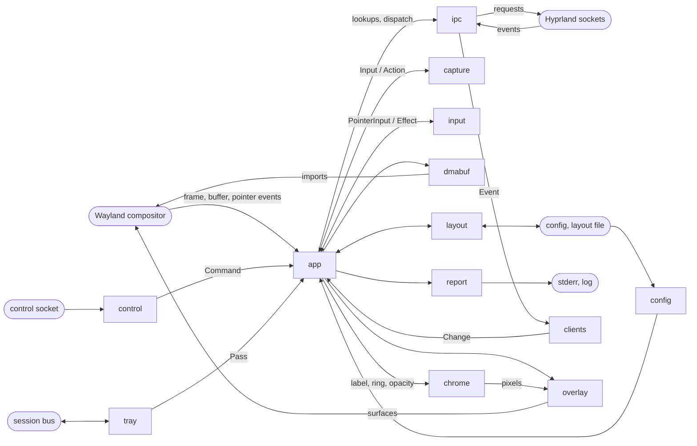

# hypr-eve-preview architecture

How the daemon works, by component, for a reader about to change it. The CLI flags, config keys, layout file format, report lines, Hyprland config lines, control commands and tray menu are in the operator reference, [hypr-eve-preview.md](hypr-eve-preview.md).

## Purpose and shape

hypr-eve-preview shows a live thumbnail of every EVE Online client window on any Hyprland monitor, each on its own layer surface above all windows. A click switches to the client's workspace, a drag moves the thumbnail, also onto another monitor, and, while snapping is on, snaps it to the edges of its monitor's usable area and to the other thumbnails there, and the grip and the wheel resize it; position, width and monitor persist per account. A global lock freezes the arrangement, a base opacity applies to every thumbnail not under the pointer, and hide tears every thumbnail down until show. A tray item and a command form (the same binary, sending one line to the daemon's control socket) switch lock, hide and snapping and set the base opacity, and the tray can quit the daemon. The daemon is one process with one thread that runs one calloop event loop. It talks to the Wayland compositor (capture, surfaces, pointer), Hyprland's two IPC sockets (window events, queries, the workspace dispatch), the session bus (the tray) and files (config, layout file, log, control socket).

## Components

| Component | Owns | In | Out | Documented in |
|---|---|---|---|---|
| `main` | `main()`: the command line, the daemon built through `app`'s `prepare` and `setup`, the command form through its `run_command`, the event loop, the stop it hands to `exit`'s `fail` or `App::shutdown` | arguments, signals | the process exit code, report lines | [runtime.md](runtime.md) |
| `app` | `App`: the Wayland objects, one record per tracked client, pending imports, orphan frames, every loop source and timer but the signal source, press, hover and hidden state, the layout and its save schedule, the control server, the tray | Wayland events, `clients` changes, control and tray commands, timers, signals | Wayland and Hyprland requests, report lines, layout writes | [runtime.md](runtime.md) |
| `exit` | `Stop`, `SetupError`; how the daemon stops: the failure texts, the `exit` line, the removal of the control socket file | stop reasons, setup and loop errors | the `exit` line, the `usage` line, the startup `layout-error` line, the process exit | [runtime.md](runtime.md) |
| `surface` | One record's surface set (home, straddling, landing) and the create, destroy, present and commit actions each event gets | surface events | `SurfaceAction` | [interaction.md](interaction.md) |
| `placement` | The placement rules: which monitor and position a record gets, its home monitor, the default row, settle and relocation | monitors, records, triggers | monitor index, width, size and position, default-row slots, `Settle` | [interaction.md](interaction.md) |
| `coords` | The layout-coordinate geometry of a drag across monitors | pointer position, monitors, press state | dragged origin, touched monitors | [interaction.md](interaction.md) |
| `cli` | Argument rules | arguments | daemon options or one control command | [control.md](control.md) |
| `config` | `Config`, defaults, validation; the XDG base-path rule | config file | `Config` | [interaction.md](interaction.md) |
| `report` | The report line set and its text; `Reporter` | lines from `app`, `exit` and `main` | stderr, log file | [runtime.md](runtime.md) |
| `ipc` | Hyprland socket paths; the event socket and its line buffer; one-shot requests; event parsing | event bytes, request replies | `Event`s, reply text | [runtime.md](runtime.md) |
| `hypr` | Hyprland JSON shapes; address, game-client, slot, usable-area and capture-handle rules | `j/*` replies, event-line addresses | clients, monitors, usable area (`geometry::Rect`), active address, capture handle | [runtime.md](runtime.md) |
| `clients` | Tracked and pending clients, skipped addresses, the thumbnail set, active address, ring owner, account keys | `Event`s, `j/clients` entries, process command lines | `Change` list | [runtime.md](runtime.md) |
| `capture` | Per-client frame and buffer state machine; the teardown plan | frame, import, release, configure and timer inputs | `Action` list | [rendering.md](rendering.md) |
| `dmabuf` | GBM device on the render node; modifier choice; dmabuf import | feedback, frame format and size | buffer objects, import params | [rendering.md](rendering.md) |
| `chrome` | Label font; ring and label rasterizer | label, ring, opacity, scale | ARGB8888 pixels | [rendering.md](rendering.md) |
| `overlay` | One thumbnail's layer surface, viewport, alpha object, chrome subsurface and shm pool | dmabufs, chrome pixels, geometry, alpha | surface requests | [rendering.md](rendering.md) |
| `protocol` | Generated hyprland-toplevel-export bindings | protocol XML at build time | proxy types | [rendering.md](rendering.md) |
| `input` | Gesture state machine, wheel remainders, cursor shape, lock copy | pointer inputs | `Effect` list | [interaction.md](interaction.md) |
| `layout` | Layout file; width, position, snap and default-row rules; save schedule | layout file, geometry | entries, positions, save actions | [interaction.md](interaction.md) |
| `geometry` | `Size`, `Point`, `Rect`; aspect-locked thumbnail size | a width and a buffer size | the thumbnail size | [interaction.md](interaction.md) |
| `control` | Command words and transitions; line protocol; socket server; command-form client | socket bytes | commands, replies | [control.md](control.md) |
| `tray` | Bus connection; item and menu objects; menu state; registration | bus messages | passes (commands, reports), bus signals | [control.md](control.md) |

`cli` runs before the loop; `hypr`, `geometry` and `protocol` are shared parsers and types.

## Lifecycle

### Startup

1. **Arguments** (`cli`). A command as the whole argument list (a command word alone, or `opacity <N>`) runs the command form instead: resolve the control socket path, send the command line, read the reply to EOF, exit. Each write and each read call waits at most 2 s, so a peer that sends slowly can make the exchange longer. It opens no other file or socket. A usage error exits 2.
2. **Log.** `--log` opens the file for append and creates missing parents. Failure: exit 1.
3. **Config.** `--config`, else the XDG default, where a missing file means defaults. Failure: exit 2; no resolvable default path: exit 1.
4. **Font.** `label.font_file` (failure: exit 2), else the file `fc-match` names (failure: exit 1). Read and parsed once.
5. **Layout.** A missing file is empty. An unreadable or malformed file is renamed aside with a `layout-error` line and the layout starts empty; a failed rename exits 1; no resolvable default path: exit 1.
6. **Hyprland sockets.** Paths from the environment (unset: exit 1). The event socket connects non-blocking (failure: exit 1); events from this point queue in it.
7. **Control socket.** Probe, remove a stale file, bind non-blocking. A daemon that answers, or a probe, removal or bind error: exit 1.
8. **Queries.** `j/monitors` gives every monitor (name, layout position, size, scale, transform, reserved edges, focus) and so the default monitor: the one `output` names, else the focused one. `j/clients` gives the snapshot, `j/activewindow` the initial focus. Failure, or no default monitor: exit 1.
9. **`start` line.**
10. **Event loop** built. Failure: exit 1.
11. **Wayland.** Connect; read the default dmabuf feedback on a private queue and open the GBM device on the render node it names; bind the globals; build `App`; roundtrip; find the default monitor's `wl_output`; insert the Wayland source. Any failure: exit 1. No surface exists yet: a thumbnail's layer surface is created at its client's first frame.
12. **Signals.** SIGINT and SIGTERM become a loop source. Failure: exit 1.
13. **Tray.** Blocking session-bus calls (`tray`). A failure before registration prints `tray-unavailable` and the daemon runs without a tray; a failed registration keeps the tray waiting for a watcher.
14. **Snapshot.** Each game client of the snapshot is tracked and its capture starts.
15. **Sources.** The event-socket and control listener sources (failure: exit 1), then the tray fd source and the drain ping (failure: `tray-unavailable`, the tray ends). One drain loop serves any bus message already queued. `control-listening` prints.
16. **Loop** until a stop is requested.

A failure before `App` exists exits directly; from step 8 it removes the control socket file first. Once `App` exists, every failure runs the shutdown below.

### Event loop

`app` owns every source and timer except the signal source, which `main` inserts: the Wayland connection, the event socket, the control listener and its accept-pause timer, each control connection and its deadline timer, one capture timer per client, one lookup retry timer per pending address, the layout save timer, the tray fd, the drain ping, and an idle callback that drops an ended tray. The event-socket, control and tray sources watch owned duplicates of their descriptors; `EventSocket` and `Server` keep the originals; `Tray` keeps its own duplicate of libdbus's watch fd. `--seconds` becomes the dispatch timeout, and the loop stops with code 0 once the deadline passes. Callbacks never exit the process. `App` keeps the first stop reason (a failed report write overrides it), and the loop takes the stop after the dispatch and runs shutdown. With a stop pending, the executors (`feed`, `execute`, `apply_changes`, `run_effects`) and the pointer, event-socket, accept and connection-deadline callbacks return early, a completed control line is closed without a reply, and `control::apply` returns the old state. The other sources still run: a lookup retry still sends its `j/clients` query and updates `clients`, whose changes `apply_changes` then drops, the save timer still writes the layout file, the accept-pause timer still re-enables the listener, and the tray fd and the drain ping still run passes and print their report lines; runtime.md's source table has a column for each source's behaviour with a stop pending. A dispatch error stops with code 1 and the Wayland error text when there is one.

### Drain loop

The tray is served in passes (`tray::Pass`), each with its report events, at most one command and `more`. `App` runs passes in one drain loop: reports print, a toggle goes through `apply_command`, `Quit` stops with code 0; the next pass is the one `set_state` returned, else a fresh `Tray::drain` while `more` is set, and the drain ping continues past 16 passes in a later dispatch. Entry points: the tray fd callback, the drain ping, startup step 15, and a control command that changed state.

### Shutdown

`App::shutdown` runs for every stop once `App` exists, in this order: the control sources and timers leave the loop and `Server::remove` shuts every connection down without a reply and unlinks the socket file; the tray fd source and the drain ping leave the loop and the tray is dropped, which closes the bus connection and releases the name; capture timers, the save timer and lookup retries are cancelled and a pending layout save is written; per record the frame is destroyed if it had an event, then the overlay and each `wl_buffer`, its buffer object kept, then the pending import params; the relative and themed pointers are released and the export and alpha managers destroyed; the Wayland connection is flushed; buffer objects are dropped, then the GBM device; the event-socket source leaves the loop and the socket closes; the `exit` line prints and the process exits. A teardown error (socket removal, flush) is appended to the reason and turns code 0 into 1. The signal source stays installed to the end, so a signal during teardown stays pending.

A failure in startup steps 1-6 removes nothing; step 7 removes a stale socket file before it binds and, when making the listener non-blocking fails, the socket file it bound; a failure in steps 8-11 before `App` exists removes the control socket file, and a stop once `App` exists removes everything above. A failed report write removes what its point in the sequence removes and exits 1 without an `exit` line. SIGINT or SIGTERM before step 12, or SIGKILL, kills the process with nothing removed; the next start removes the stale socket file. The log file is never removed; it closes with the process.

## Data flows

### Client windows

1. Hyprland → `ipc`: event lines on the event socket.
2. `ipc` → `clients`: `Event`.
3. `clients` → `app`: a `Change` list.
4. `app` → `ipc` → Hyprland: `j/clients` for a `Lookup`; `hypr` parses the reply into `hypr::Client` entries, which go to `clients`, which reads the process command line of each window with a game title.
5. `app` → `layout`: an added client's account key, for its saved `Entry` or a place in the default row.
6. `app` → `capture`, `chrome`, `report`: `Input::Start` or the teardown plan, chrome redraws, the client report lines.

Mechanism: [runtime.md](runtime.md) for the feed and `clients`, [interaction.md](interaction.md) for placement.

### Frames

1. `capture` → `app` → compositor: `RequestFrame`, sent as `capture_toplevel` with the capture handle and a `wl_display.sync`.
2. compositor → `app` → `capture`: the export frame's `linux_dmabuf` and `buffer_done`, fed as `FrameDescribed`.
3. `capture` → `app` → `overlay`, `dmabuf`: `CreateOverlay` (the thumbnail's layer surface) and `Allocate` (a buffer and its import params); the first layer `configure` and `created` come back as `OverlayConfigured` and `Imported`.
4. `capture` → `app` → compositor: `Copy`, sent as `frame.copy` into a buffer's `wl_buffer`.
5. compositor → `app` → `capture`: `flags` and `ready`, fed as `Flags` and `Ready`.
6. `capture` → `app` → `chrome`, `overlay` → compositor: `Present`, the buffer and, when due, the chrome pixels in one layer commit, then `DestroyFrame`.
7. compositor → `app` → `capture`: `wl_buffer.release` of the displaced buffer, fed as `Released`.

Mechanism: [rendering.md](rendering.md).

### Pointer gestures

1. compositor → `app`: the `wl_pointer` events of a pointer frame, and `zwp_relative_pointer_v1` motion.
2. `app` → `input`: `PointerInput`s for the thumbnail whose layer surface an event names, then `FrameEnd`; Enter and Leave also set the hovered thumbnail's opacity through `overlay` and `chrome`.
3. `input` → `app`: an `Effect` list.
4. `app` → compositor, Hyprland: `Cursor` as the pointer's cursor shape; `Click` as `/dispatch workspace name:<ws>` through `ipc`; `Drag`, `ResizeTo` and `Resize` as a position from `coords` or a width from `placement`, by `layout`'s rules, sent as layer margins or size through `overlay`.
5. `app` → `layout` → the layout file: `DragEnd`, `ResizeEnd` and each wheel step, as the client's `Entry` under its account key and a save.

Mechanism: [interaction.md](interaction.md).

### Commands

1. A peer → `control`: a command line on the control socket; the bus → `tray`: a menu click.
2. `control` → `app`: `ReadOutcome::Line` with a `Command`; `tray` → `app`: a `Pass` with `TrayEvent::Command`.
3. `app` → `control::apply`: the `Toggles` and the `Command`, back as the new `Toggles`; `Quit` requests the stop instead.
4. `app` → `input`, `layout`, `capture`, `overlay`, `chrome`, `report`: a lock, snap or opacity change sets its state (`layout.locked`, then `set_locked`; `layout.snapping`; `layout.opacity`, then the alpha and chrome of every non-hovered overlay), prints the `lock`, `snap` or `opacity` line, then requests a save; hide and show run teardown plans or new captures, then print `visibility`. Each line carries its `report::Source`.
5. `app` → `tray` → the bus: `set_state` with the new `Toggles` when they changed, sent as `ItemsPropertiesUpdated` and `LayoutUpdated`, plus `NewIcon` when hide changed.
6. `app` → `control` → the peer: the reply `ok`.

Mechanism: [control.md](control.md) for the socket and the tray, [runtime.md](runtime.md) for what each command changes.

### Tray

1. The bus → `tray`: method calls on the tray item and its menu, the watcher's `NameOwnerChanged`, the register reply.
2. `tray` → the bus: method replies and `RegisterStatusNotifierItem`.
3. `tray` → `app`: a `Pass` of `TrayEvent`s (`Command`, `Registered`, `Unavailable`) and `more`.
4. `app` → `report`: `Registered` and `Unavailable` as `tray-registered` and `tray-unavailable` report lines.

Mechanism: [control.md](control.md).

## External interfaces

**Wayland.** Ranges marked sctk are sctk's bind ranges.

| Interface | Version | Use | Owner |
|---|---|---|---|
| `wl_compositor` | 1-6 (sctk) | surfaces, regions | `overlay`; `app` for the cursor surface |
| `wl_subcompositor` | 1 (sctk) | chrome subsurface | `overlay` |
| `wl_shm` | 1 (sctk) | chrome buffers (ARGB8888); cursor theme fallback | `overlay`; `app` for the cursor theme |
| `zwlr_layer_shell_v1` | 1-4 (sctk) | one overlay-layer surface per thumbnail at rest, one per monitor its rectangle touches during a drag | `overlay` |
| `wp_viewporter` | 1 | dmabuf and chrome scaled to the thumbnail size | `overlay` |
| `wp_alpha_modifier_v1` | 1 | thumbnail opacity | `overlay` |
| `hyprland_toplevel_export_manager_v1` | 1-2 | capture frames: `capture_toplevel` and, at shutdown, the manager's `destroy`, both version 1 | `app` |
| `zwp_linux_dmabuf_v1` | 3-5 (sctk), at least 4 for the feedback | default feedback on the probe queue; buffer imports | `app`; `dmabuf` for the params requests |
| `zwp_relative_pointer_manager_v1` | 1 (sctk), must be advertised | drag and resize offsets | `app` |
| `wl_seat` | 1-10 (sctk; later seats 1-7) | the pointer capability | `app` |
| `wp_cursor_shape_manager_v1` | 1-2 (sctk), optional | cursor shapes, else the xcursor theme over `wl_shm` | `app` |
| `wl_output` | 1-4 (sctk; xdg-output 1-3 when present) | one per monitor, found by its `j/monitors` name: the default monitor's at startup, a monitor's at each surface creation on it | `app` |
| `wl_display.sync` | core | detects a capture request for a vanished window | `app` |

**Hyprland IPC.** Both sockets live in the instance directory below.

| Socket | Traffic | Owner |
|---|---|---|
| `.socket.sock` (requests) | one connection per request, 1 s read and write timeouts: `j/monitors`, `j/clients`, `j/activewindow` at startup; `j/clients` per game `openwindow` and its retry; `/dispatch workspace name:<ws>` per click | `ipc` |
| `.socket2.sock` (events) | one non-blocking connection for the daemon's life: `openwindow`, `closewindow`, `windowtitlev2`, `movewindowv2`, `activewindowv2`; other names skipped | `ipc` |

**D-Bus** (one private session-bus connection; libdbus resolves the bus).

| Item | Value | Owner |
|---|---|---|
| Owned name | `org.kde.StatusNotifierItem-<pid>-1` | `tray` |
| `/` | `org.freedesktop.DBus.Introspectable` only, which dbus-crossroads exports | `tray` |
| `/StatusNotifierItem` | `org.kde.StatusNotifierItem`, plus `org.freedesktop.DBus.Properties` and `Introspectable`; emits `NewIcon` when hide changes | `tray` |
| `/MenuBar` | `com.canonical.dbusmenu` (version 3), plus `Properties` and `Introspectable`; five root items: Lock thumbnails, Hide thumbnails, Snap thumbnails, Opacity (a submenu of ten steps, 10% to 100%), Quit; emits `ItemsPropertiesUpdated` and `LayoutUpdated` | `tray` |
| Calls out | `RegisterStatusNotifierItem` on `org.kde.StatusNotifierWatcher` at `/StatusNotifierWatcher`; `RequestName` and `AddMatch` on `org.freedesktop.DBus` | `tray` |
| Signal watched | `NameOwnerChanged` from `org.freedesktop.DBus` with arg0 `org.kde.StatusNotifierWatcher` | `tray` |

**Files.** `<base>(VAR, fallback)` is `$VAR` when set, non-empty and absolute, else `$HOME/<fallback>`.

| File | Path | Access | Owner |
|---|---|---|---|
| Config | `--config`, else `<base>(XDG_CONFIG_HOME, .config)/hypr-eve-preview/config.toml` | read once | `config` |
| Layout: lock, snapping, opacity, per-account entries | `<base>(XDG_STATE_HOME, .local/state)/hypr-eve-preview/layout.json`; `layout.json.tmp` and `layout.json.bad` beside it | read at startup; temp file and rename | `layout` |
| Log | `--log` | append | `report` |
| Instance directory | `$XDG_RUNTIME_DIR/hypr/$HYPRLAND_INSTANCE_SIGNATURE/` | Hyprland's two sockets | `ipc` |
| Control socket | `.hypr-eve-preview.sock` in the instance directory | listen for the command form's ten commands (`lock`, `unlock`, `hide`, `show`, `toggle-lock`, `toggle-hide`, `snap`, `unsnap`, `toggle-snap`, `opacity <N>`); unlinked at exit | `control` |
| Font | `label.font_file`, else the file `fc-match` prints | read once | `chrome` |
| Process command line | `/proc/<pid>/cmdline` of each window with a game title | read at most once each time a window with a game title appears (startup snapshot or `openwindow`) | `clients` |
| Render node | the `/dev/dri/renderD*` node whose device number matches the feedback | read-write, GBM | `dmabuf` |
| Cursor theme | `<dir>/<theme>/index.theme` and `<dir>/<theme>/cursors/<name>` for `$XCURSOR_THEME` (else `default`) and the themes it inherits; `<dir>` from `$XCURSOR_PATH`, else the XDG data and icon directories | read at a cursor name's first use, only without the cursor-shape global | `app` (sctk) |

**Environment.** `XDG_RUNTIME_DIR` and `HYPRLAND_INSTANCE_SIGNATURE` (Hyprland and control sockets; the command form too), `HOME`, `XDG_CONFIG_HOME`, `XDG_STATE_HOME` (paths above), read by `app`. Libraries read `WAYLAND_DISPLAY`, `WAYLAND_SOCKET` and `XDG_RUNTIME_DIR` (wayland-client), `XCURSOR_THEME` and `XCURSOR_SIZE` (sctk, for every pointer), `HOME`, `XCURSOR_PATH`, `XDG_DATA_HOME` and `XDG_DATA_DIRS` (the xcursor theme search, only without the cursor-shape global), `DBUS_SESSION_BUS_ADDRESS` (libdbus, to find the session bus) and `PATH` (to find `fc-match`).

## Invariants

- **One thread.** Descriptors the daemon waits on are calloop sources. The only blocking calls are Hyprland requests (1 s read and write timeouts), the Wayland setup roundtrips, the tray's startup calls, the tray's `Channel::flush` in a pass and in `set_state` (until libdbus's outgoing queue is empty), the startup `fc-match` run and file I/O.
- **No `unsafe` outside `protocol`.** The crate root denies it, so descriptors handed to calloop are owned duplicates; the tray's comes from `pidfd_getfd` because the dbus crate exposes the watch fd only as a raw fd.
- **No `unwrap` or `expect` outside tests and the generated `protocol` module.** The crate root denies both; `protocol` silences lints, these two included.
- **Errors are returned or reported.** A fatal error becomes the `exit` reason, a recoverable one a report line; a failed report write leaves only exit code 1.
- **Callbacks only request a stop.** The first reason wins; once it is set no executor acts and `control::apply` changes nothing.
- **Per-client teardown order:** timer, frame, overlay, buffers, imports, so no server reference to a destroyed buffer remains.
- **A frame without an event is never destroyed by request;** it becomes an orphan, which its first event destroys and its sync `done` forgets.
- **Destruction order:** protocol objects before their surface (alpha object, viewports and subsurface before the `wl_surface`), the chrome surface before its buffer; a buffer the compositor still holds is destroyed at its release, possibly after its shm pool; a `wl_buffer` before its buffer object, buffer objects before the GBM device.
- **Captured pixels never reach the CPU.** Buffer objects are never mapped; only chrome pixels are drawn on the CPU.
- **Capture limits:** one frame in flight per client, the copy target always a free buffer, at most 30 copies per second.
- **Even geometry.** Thumbnail widths and heights, and every position sent to the compositor, are even logical px. A move never attaches a buffer.
- **Hidden means no capture work.** No record holds a capture, overlay, frame, buffer or capture timer while hidden; records, clients and the ring owner stay.
- **The control socket file is removed on every exit path the process controls** after the bind. A file left by a kill is removed as stale by the next start.
- **The layout file** changes only by temp file, sync and rename. Startup never writes it and can only rename a bad file aside. Writes while running are at least 500 ms apart; shutdown writes an armed save before its deadline, so the last two writes can be closer.
- **Command-line secrecy.** Only the decoded user id leaves a process command line, inside an account key.
- **Narrow side effects.** The only Hyprland requests are the three `j/*` queries and the workspace dispatch; the only subprocess is `fc-match`.
