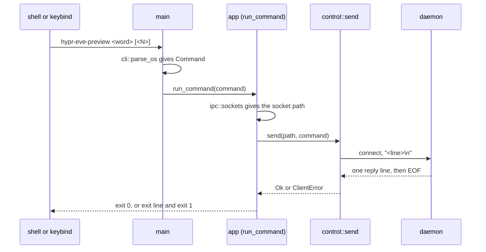
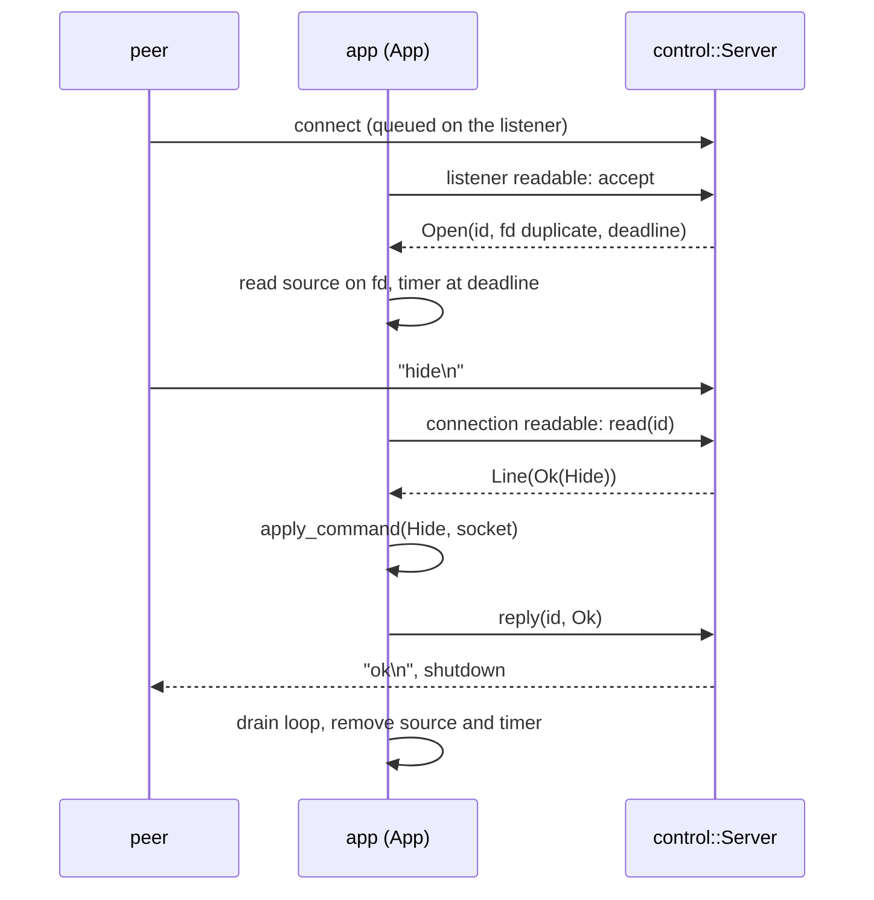
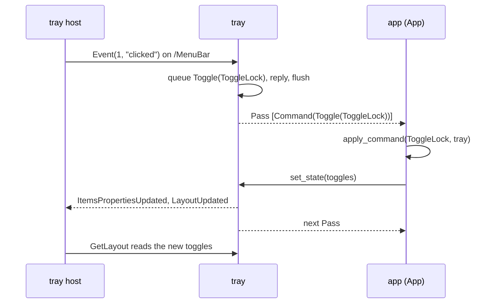

# Control plane

## Scope

The control plane carries lock, hide, snap, opacity and quit requests into the daemon and carries the result back. It has three modules: `control` (the control socket server, the command words and the command-form client), `tray` (the tray item and its menu on the session bus) and `cli` (the argument grammar that selects the daemon or the command form). A request ends at `App`, which applies it; the reply goes back as a socket reply or a menu update. [architecture.md](architecture.md) has the whole-app view; the operator's view of the same contract is in [hypr-eve-preview.md](hypr-eve-preview.md).

## From a command to a reply

### The command form

1. `main` parses the arguments before anything else. `cli` returns a command only when the first argument is a fieldless command word with nothing after it, or `opacity` with exactly one valid value after it.
2. `run_command` opens a stderr-only reporter (no log file, no verbose lines). `ipc::sockets` gives the control socket path; a missing variable exits 1.
3. `send` connects, sets a 2 s timeout on each write and each read call, writes the request line (`Command::line()`, the `<line>` above) and `\n`, then reads to EOF. The whole text read must equal one reply exactly.
4. `run_command` never returns: `Ok` exits 0 and prints nothing; every error prints the `exit` line with code 1 and the error's text as the reason.

| What `send` sees | Error | `exit` reason |
|---|---|---|
| `ok\n` | none | none |
| `error: <r>\n`, `<r>` one of the six refusal reasons | `Refused` | `<r>`, for example `busy` |
| Connect fails (no daemon, no file) | `Connect` | `connect <path>: <error>` |
| `WouldBlock` or `TimedOut` on a write or read call (2 s per call) | `Timeout` | `no reply within 2 s` |
| Any other I/O error | `Io` | the OS error text |
| Any other text, including `error: ` with an unknown reason | `BadReply` | `unexpected reply` |

A busy daemon writes its refusal and closes without reading the request. The request write can then fail with `EPIPE`, and the read can end in `ECONNRESET` with the refusal already buffered. `send` keeps these two errors aside and matches the buffered text first. Only when the text is no known reply does the kept error become `Io`; without one it is `BadReply`.

### Inside the daemon

- **Listener.** `app` watches a duplicate of the listener descriptor in a level-mode read source. Its callback calls `accept`, which takes connections until `WouldBlock`. Each connection becomes non-blocking. While 8 are open, the new one is answered `error: busy` and shut down at once, unread, and `app` prints `control-error error="busy"`. Otherwise it gets the next id, a duplicate descriptor for `app` and a deadline of accept time plus 1 s.
- **Accept errors.** `accept` stops at the first error other than `Interrupted` (a failed `set_nonblocking` or duplicate of the new stream included, which drops that stream) and returns it with the admissions so far. `app` prints `control-error error="accept: <error>"`, disables the listener source and re-enables it from a 100 ms timer. A failed insert of that timer, or a failed re-enable when it fires, stops the daemon with code 1 and reason `event loop: <e>`.
- **Per connection.** `app` inserts a level-mode read source on the duplicate and a timer at the deadline. A failed insert prints `accept: <error>` and closes the connection.
- **Apply and reply.** A complete command goes to `app`'s `apply_command` with source `socket`, which owns what the change does. When the toggles change and a tray exists, `apply_command` runs `Tray::set_state` before it returns. The reply `ok` follows.

| `read` outcome | `app` does | Reply | `control-error` |
|---|---|---|---|
| `Pending` (no complete line) | waits for the next readable event | none | none |
| `Line(Ok(command))` | applies, replies | `ok` | none |
| `Line(Err(refusal))` | replies | `error: <reason>` | `<reason>` |
| Any `Line` once a stop is pending | closes | none | `shutdown: <e>` on failure |
| `Closed` (EOF before any byte) | nothing more | none | `shutdown: <e>` on failure |
| `Failed` (read error; the server closed it) | nothing more | none | `read: <e>`, then `shutdown: <e>` on failure |
| Deadline timer fires on an open connection | calls `timeout` | `error: timeout` | `timeout` |

Every outcome other than `Pending`, and the deadline, removes the connection's source and timer. A failed reply prints `reply: write: <e>; shutdown: <e>` with the parts present. Once a stop is pending, accept does nothing and a deadline does nothing; shutdown closes what remains without a reply.

**The socket file.** `app` binds the server at startup. `Server::bind` first probes the path with a connect:

| Probe result | Action | Failure, as the exit reason |
|---|---|---|
| Connects | startup fails | `control socket <path>: another hypr-eve-preview answers` |
| `ECONNREFUSED` (a stale socket or any other file) | unlink (`ENOENT` ignored), then bind | `control socket <path>: remove stale: <error>` |
| `ENOENT` | bind | none |
| Any other error | startup fails | `control socket <path>: connect: <error>` |
| Bind or `set_nonblocking` fails | unlink after a `set_nonblocking` failure | `control socket <path>: bind: <error>` |

The probe sends nothing and closes, so a running daemon reads EOF before any byte: `Closed`, no reply, no line. `Server::remove` shuts every open connection down without a reply, closes the listener and unlinks the path (`ENOENT` ignored); its errors join into one. `exit`'s `remove_control` calls it, from `app`'s shutdown and startup failures and from `main`'s startup failures after the bind, and a failure becomes the teardown text `control socket <path>: remove: <error>`. A killed daemon leaves the file, and the next start takes the `ECONNREFUSED` row.

### The tray path

- `Event`, and each element of `EventGroup`, with event id `clicked` queues the item's command from the menu table below in the menu state's pending list. Other event ids, and every event on the Opacity item, are accepted and ignored.
- The handler only queues. The pass flushes the method reply, then returns the command, so the host has its reply before `App` acts.
- A toggle goes through the same `apply_command` as a socket command, with source `tray`. `Quit` requests the stop with code 0 and reason `tray quit` and ends the drain loop.
- **Menu state.** The menu's toggles are a copy of `App`'s `Toggles` (`locked`, `hidden`, `snapping`, `opacity`). `App` sets them at start and through `set_state` after every change from either source; a click never changes them. `set_state` first sets the tray item's hidden flag, so a host that re-reads `IconPixmap` on `NewIcon` gets the new icon. It then stores the toggles, raises the revision by one (wrapping), and sends `ItemsPropertiesUpdated` with one `toggle-state` entry per changed item (in the order Lock, Hide, Snap thumbnails, the step that lost its check, the step that gained it) and an empty removed list, then `LayoutUpdated(revision, 0)`, then `NewIcon` only when `hidden` changed. It flushes and runs one pass, which `App` takes as its next pass. The menu methods build each item from the stored toggles at call time.

## The tray lifecycle

| Step or event | `tray-unavailable` reason | Tray afterwards |
|---|---|---|
| Private session-bus connection (libdbus connects and sends `Hello`) | `session bus: <error>` | none |
| Connection already down after enabling the watch | `session bus: disconnected` | none |
| Watch-fd duplicate: `pidfd_open`, then `pidfd_getfd` | `watch: pidfd_open: <e>`, `watch: pidfd_getfd: <e>` | none |
| `RequestName` `org.kde.StatusNotifierItem-<pid>-1`, do-not-queue, 1 s; only primary owner counts | `name <name>: <error>`, `name <name>: reply code <n>` | none |
| `AddMatch` for the watcher's `NameOwnerChanged`, 1 s | `match rule: <error>` | none |
| `RegisterStatusNotifierItem(name)` on the watcher, 1 s; success prints `tray-registered` | `register: <error name>: <message>` | up, waits for a watcher |
| `app` inserts the fd source and the drain ping | `watch: <error>`, `watch: dup: <e>` | ends |
| Watcher gets an owner; its register reply is an error | `register: <error name>: <message>` | up |
| Watcher leaves the bus | `StatusNotifierWatcher left the bus` | up, waits |
| Pass 16 of a drain loop still has a command or `more` | `drain: 16 passes` | up |
| A pass or `set_state` fails to read or send, or finds the connection down | `session bus: disconnected` | ends |

"None" means no `Tray` exists for the rest of the run. "Ends" means `app` removes the fd source and the ping and drops the `Tray`. No row stops the daemon: the dbus crate turns off libdbus's exit-on-disconnect, and the tray has no path to a stop except `Quit`. There is no reconnection. At shutdown `app` removes the fd source and the ping, then drops the `Tray`; the drop closes the private connection, and the bus releases the name with it.

**Watcher and registration.** The match rule selects `NameOwnerChanged` signals from the bus daemon with arg0 `org.kde.StatusNotifierWatcher`. A non-empty new owner (a watcher that appears or is replaced) makes the pass send `RegisterStatusNotifierItem` without blocking and record the call's serial with that owner's unique name, replacing any earlier record. An empty new owner reports the watcher's departure and changes nothing else. A method return or error is the register reply only when its reply serial is the recorded one and its sender is the recorded owner or the bus daemon (which answers when the destination is missing or leaves without a reply); it clears the record and reports `tray-registered` or `tray-unavailable`. The tray keeps no registered flag; the reports are the only trace.

**Objects.**

| Path | Interface | Content |
|---|---|---|
| `/` | `org.freedesktop.DBus.Introspectable` only | dbus-crossroads exports it; no data |
| `/StatusNotifierItem` | `org.kde.StatusNotifierItem` | read-only `Category` `ApplicationStatus`, `Id` and `Title` `hypr-eve-preview`, `Status` `Active`, `IconPixmap`, `Menu` `/MenuBar`, `ItemIsMenu` true; `Activate`, `SecondaryActivate`, `ContextMenu`, `Scroll` succeed and do nothing; signal `NewIcon` |
| `/MenuBar` | `com.canonical.dbusmenu` | read-only `Version` 3, `Status` `normal`; the methods below; the two signals above |

`IconPixmap` holds two ARGB pixmaps, 24 and 48 px: a ring in `border.color` while thumbnails are shown, in red (`#FF0000`) while they are hidden. Both sets are built once at start. A pixel whose centre lies between 0.30 and 0.45 of the side from the image centre carries the colour, not premultiplied; every other pixel is transparent. The menu root is id 0 (`children-display` `submenu`) with five items, in menu order:

| Id | Label | Properties | `clicked` queues |
|---|---|---|---|
| 1 | `Lock thumbnails` | checkmark, on while `locked` | `Toggle(ToggleLock)` |
| 2 | `Hide thumbnails` | checkmark, on while `hidden` | `Toggle(ToggleHide)` |
| 5 | `Snap thumbnails` | checkmark, on while `snapping` | `Toggle(ToggleSnap)` |
| 4 | `Opacity` | `children-display` `submenu`; children 11 to 20 | nothing |
| 11 to 20 | `10%` to `100%`; id = 10 + percent/10 | checkmark, on while `opacity` equals the percent | `Toggle(Opacity(<percent>))` |
| 3 | `Quit` | label only | `Quit` |

A checkmark item has `toggle-type` `checkmark` and `toggle-state` 1 while on, else 0; no step is on while `opacity` is 0 or not a multiple of 10. The steps are checkmarks, not radio items: the tray host in use renders radio items as plain labels and closes the menu on a click, while checkmark items are switches and the menu stays open. That host re-reads `IconPixmap` on `NewIcon`, ignores `ItemsPropertiesUpdated`, and refreshes the menu on `LayoutUpdated` and after a click.

| Method | Behaviour |
|---|---|
| `GetLayout(parent, depth, names)` | revision and the subtree at `parent`: depth 0 the item alone, n the item and n levels below it, negative the whole subtree (two levels under the root); `names` filters properties, empty keeps all |
| `GetGroupProperties(ids, names)` | for empty `ids` every node of the whole tree, depth first; else each known id alone (no children), in request order, unknown ids skipped; never fails |
| `GetProperty(id, name)` | the value |
| `Event(id, eventId, data, timestamp)` | the click rule above |
| `EventGroup(events)` | `Event` per element in order; the refused ids; fails when none was accepted, an empty list included |
| `AboutToShow(id)` | false |
| `AboutToShowGroup(ids)` | no updates and the unknown ids; fails when a non-empty list has only unknown ids |

Where a row does not say otherwise, an unknown id is an `InvalidArgs` error with the message `Invalid argument "unknown menu item <id>"`. For `Event` the root id 0 is unknown. An unknown name in a `names` filter is no error: `GetLayout` and `GetGroupProperties` return only the known names. `GetProperty` alone refuses an unknown name, with `Invalid argument "unknown property <name>"`.

**Passes.** A pass (`Tray::drain`) first returns the first pending command, with no bus I/O. Otherwise it reads the connection without blocking and pops messages: method calls go to dbus-crossroads, which queues the reply; signals go to the watcher rule; replies go to the register check. It stops at the first method call that leaves a command pending, so `App` applies a click before the next message is handled. When it queued anything it flushes, which blocks until libdbus's outgoing queue is empty; then it checks the connection. It returns its reports, at most one command (last), and `more`: true when it stopped at a command or flushed.

`more` exists because libdbus reads incoming messages while it flushes and during its blocking calls. A message read that way waits in libdbus's queue and leaves the socket unreadable, so the level-mode fd source does not fire for it. While `more` is true, another pass may find such messages.

**The bus fd.** calloop's `Generic` source needs an owned descriptor, the crate root denies `unsafe`, and libdbus exposes its watch only as a raw fd number. `pidfd_open` on the daemon's own pid, then `pidfd_getfd` of that number, gives an owned duplicate without `unsafe` (rustix feature `process`, Linux only). The watch must be enabled first, because the dbus crate panics on a watch query otherwise. `source()` hands `app` a further duplicate for a level-mode read source. libdbus closes its own socket when the connection drops, inside whichever call notices it; the source's duplicate stays valid until calloop unregisters and drops it.

## Components

### `control`

- **State.** `Server`: the non-blocking listener, its path, the next connection id (never reused), and per open connection the stream, a line reader that holds at most 65 bytes, and a completed flag. Pure parts: the ten commands (nine fieldless words and `opacity <N>`), `Toggles` with `apply`, the `Refusal` set and the fixed reply texts.
- **Words and transitions.** `Command::parse` is the only mapping from a request line to a command, exact and bytewise. A line equal to a fieldless word (`Command::from_word`) is that command. A line that starts with `opacity` and one ASCII space is `opacity <N>` when the rest is 1 to 3 ASCII digits worth at most `config::MAX_OPACITY` (100), and `bad value` otherwise (`opacity 101`, `opacity 5a`, a second space, a trailing space). Every other non-empty line is `unknown command`, including `opacity` alone, a capital letter and a fieldless word with a trailing space; an empty line is `empty line`. `Command::line()` is the request line without its terminator: the word, or `opacity`, a space and the value. `apply` returns its input unchanged once a stop is pending, else:

| Command | `apply` sets |
|---|---|
| `lock` | `locked` true |
| `unlock` | `locked` false |
| `hide` | `hidden` true |
| `show` | `hidden` false |
| `toggle-lock` | `locked` flipped |
| `toggle-hide` | `hidden` flipped |
| `snap` | `snapping` true |
| `unsnap` | `snapping` false |
| `toggle-snap` | `snapping` flipped |
| `opacity <N>` | `opacity` N |

- **Line reader.** It collects bytes until `\n`, which classifies the line with `Command::parse`, or until the 65th byte, which is `TooLong`. EOF after bytes classifies what arrived; EOF with nothing is no line. Bytes after the line are ignored.
- **Server.** `read` asks only for the reader's remaining room and stops at `WouldBlock`, a complete line or EOF; after a line it reads nothing more from that connection. `reply` is one non-blocking write of the whole reply (a short write is an error), then `shutdown(Both)`, then the stream is dropped. `timeout` is `reply` with `timeout`; `close` shuts down without a reply. Every close shuts the socket down because `app`'s source still holds a duplicate descriptor until it removes the source; the shutdown makes the peer read EOF at once.
- **Client half.** `send` is the whole command-form exchange described above. It shares the words and the reply texts with the server and holds no state.
- **Refusals.** `Empty`, `Unknown`, `TooLong`, `Timeout`, `Busy`, `BadValue` (`error: bad value`). `Display` is cut from the reply text, so reason and reply cannot drift, and `send` matches replies by walking the set along the `Refusal::next` successor chain. A new refusal must be linked into `Refusal::next` as the new last element, else `send` reports its reply as `unexpected reply`; a unit test pins the chain.
- **Slow or silent peers.** Nothing blocks: listener and streams are non-blocking, and a reply is one write that is never retried. A peer that never ends its line gets `error: timeout` 1 s after accept, however slowly it sends. A peer that never reads its reply costs one write attempt; a failure is reported and the connection closed. The ninth concurrent connection is refused at accept, unread.
- **Boundary.** In: peer bytes, and calls from `app` (`bind`, `listener_fd`, `accept`, `read`, `reply`, `timeout`, `close`, `send`) and from `exit` (`remove`). Out: admissions and read outcomes carrying a command or a refusal, and error values. It never touches the event loop and prints nothing: `app` owns every source and timer except the signal source, which `main` inserts, and every line is printed by `app` or `exit`. `tray` uses `Command` and `Toggles`; `cli` uses `Command`. `report` builds the `usage` syntax from `COMMANDS` (usage order) and `OPACITY_WORD`; it writes the `opacity <N>` form by hand after the fieldless words. From `config` it takes only `MAX_OPACITY`.

| Error | From | Shape |
|---|---|---|
| `ControlError` | `bind` | `Answers`, `Connect`, `RemoveStale`, `Bind`; `Display` is the exit reason |
| `ReplyError` | `reply`, `timeout`, busy admission | the write error and the shutdown error, at least one present |
| `ReadOutcome::Closed`, `Failed` | `read` | the shutdown result; the read error and the shutdown result |
| `io::Error` | `close`, `remove` | the shutdown error; for `remove` every shutdown and unlink error in one, with the first error's kind |
| `ClientError` | `send` | `Connect`, `Timeout`, `Io`, `Refused(reason)`, `BadReply` |

- **Failure.** A bind error ends startup with exit 1. Every server error at runtime goes back to `app` as a value and becomes a `control-error` line; none stops the daemon. An event-loop error around the accept pause does (code 1, `event loop: <e>`). No shutdown error is dropped. A `send` error is the command form's `exit` reason.

### `tray`

- **State.** The private session-bus `Channel`; the dbus-crossroads object tree, whose `/StatusNotifierItem` data is the shown icon, the hidden icon and the hidden flag, and whose `/MenuBar` data is the menu state (toggles, revision, pending commands); the owned name; the outstanding register call (serial, watcher owner); the watch-fd duplicate.
- **How.** Single-threaded: every call runs on `App`'s thread. The method handlers call pure functions over the menu state and only read it or append to its pending list; they never touch `App`. The entry points are `start` (the blocking setup), `drain` (one pass), `set_state` (mirror the toggles, then one pass), `defer` (put a command first, no bus I/O) and `source`.
- **Sender checks.** A peer can send a `NameOwnerChanged` signal straight to the tray's unique name, which no match rule filters, and can send a method return or error that carries a guessed reply serial. The bus daemon stamps every message with its sender's unique name, so only the bus itself can appear as `org.freedesktop.DBus`. The tray therefore takes an owner change only when sender and interface are `org.freedesktop.DBus`, and a register reply only from the recorded owner or the bus. Without the checks a peer could make the tray register with an owner of its choice or fake the registration result.
- **Boundary.** In from `app`: pid, toggles and `border.color` at start; toggles in `set_state`; deferred commands. In from the bus: method calls, watcher owner changes, register replies. Out to `app`: passes whose events are `Command(Toggle(c))`, `Command(Quit)`, `Registered` and `Unavailable(reason)`; `app` prints the last two as `tray-registered` and `tray-unavailable`. Out to the bus: method replies, the two menu signals, `NewIcon`, register calls. From `control` it uses `Command` and `Toggles`; from `config` only `Color`, for the icons.
- **Failure.** A setup error before the register call is `Err` and leaves no tray. A failed register call is the inner `Err` and keeps the tray. A bus failure at runtime is `Err("session bus: disconnected")` from `drain` or `set_state`, and `app` ends the tray. Reasons are plain strings that become `tray-unavailable` lines.

### `cli`

- **State.** None. It does no I/O.
- **Grammar.** `parse_os` converts every argument to UTF-8 before any other rule; the first that fails is `argument <n> is not UTF-8` (1-based), even after a command word. A first argument that is a fieldless command word selects the command form. A first argument `opacity` selects it too and takes the next argument as its value: none is `opacity needs a value`, and one that is not 1 to 3 ASCII digits worth at most 100 is `invalid opacity "<v>": want 0 to 100`. Any argument after the command is `<command>: unexpected argument "<arg>"`. Otherwise the flags apply: `--config`, `--log` and `--seconds` take the next argument as their value whatever it looks like, `--verbose` and `--ignore-damage` take none, and each may occur once. `--seconds` parses as an unsigned decimal from 1 to 86400 (a leading `+` and leading zeros pass). Anything else is `unknown argument "<arg>"`: `--flag=value`, a positional, `--help`, or a command word after a flag (`--verbose snap` fails on `snap`).
- **Boundary.** In: the arguments after argv[0], parsed first thing in `main`. Out: `Invocation::Daemon(Args)`, which continues startup in `main`, or `Invocation::Command(command)`, which `main` hands to `run_command`. From `control` it uses `Command::from_word`, `Command::opacity_value`, `Command::word` and `OPACITY_WORD`; from `config`, `MAX_OPACITY` in the `InvalidOpacity` text.
- **Usage errors.** `UsageError` is `Unknown`, `MissingValue`, `Duplicate`, `InvalidSeconds`, `NotUtf8`, `InvalidOpacity` or `CommandArgument`; `Display` is the message. `exit` prints, for `main`, the `usage` line, then the `exit` line with code 2, to stderr only, before any file or socket opens.

## Invariants

- **One mapping from bytes to a command.** `Command::from_word` and `Command::opacity_value` serve the socket (through `Command::parse`) and the command line, so both accept exactly the same nine words and the same `opacity` values.
- **A command is only ever the whole invocation.** It is the first argument, followed only by the value for `opacity`. A command word in another position, or another argument after the command, is a usage error, so no daemon flag reaches the command form.
- **One request per connection.** After a line completes the server reads no more, and `app` replies or closes in the same callback.
- **Bounded per connection.** At most 65 bytes held, a deadline 1 s after accept, at most 8 open connections; no read or reply blocks the loop.
- **Every close shuts the socket down,** so the peer sees EOF while `app`'s duplicate descriptor is still registered.
- **Fixed replies, no echo.** Replies are `ok` or the six refusal texts, and `control-error` carries a reason or an OS error, never received bytes.
- **`ok` follows the apply.** The reply is written after `apply_command` and its `set_state` returned.
- **No command after a stop.** `apply` returns its input, accept stops, a completed line is closed without a reply, and a deadline does nothing.
- **The socket file is removed on every exit the process controls after the bind.** Shutdown and every later startup failure call `Server::remove`; a killed daemon's file is removed as stale by the next start.
- **The tray never stops the daemon.** Every tray error is a report line; `Quit` is the only tray path to a stop.
- **The tray never changes the toggles itself.** Handlers only queue; the menu toggles change only in `set_state`, which `App` calls after it applied a change.
- **A click is applied before the next bus message.** A pass ends at the first queued command.
- **A register reply counts only from the recorded owner or the bus,** with the recorded serial; an owner change counts only from the bus daemon.
- **The command form opens nothing but the control socket:** no log, config, layout file or Hyprland socket.
