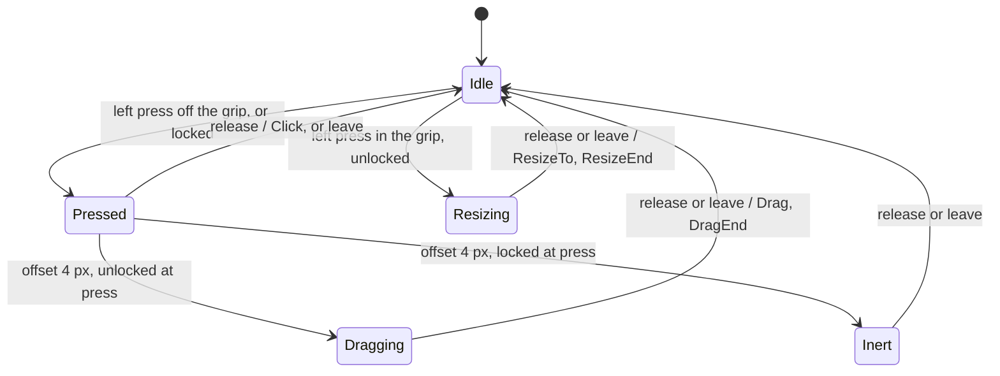

# Interaction

## Scope

Interaction turns pointer input on the thumbnails into workspace switches, moves and resizes, bounds and snaps the resulting geometry, and keeps that geometry, the lock, the snapping switch and the base opacity in the layout file. It comprises `input` (the gesture machine), `geometry` (the `Size`, `Point` and `Rect` types and the aspect-locked thumbnail size), `layout` (the width, position, snap and default-row rules, the layout file and its save schedule), `placement` (which monitor and position a record gets), `coords` (the layout-coordinate geometry of a drag across monitors), `surface` (the surfaces a record has: home, travellers, landing) and `config` (the settings that shape `layout` and the values `app` applies to `input`'s effects). `app` wires them: it holds the pointers, the per-client records, the press start, the hovered thumbnail and the save timer. For the whole-app view (startup, loop sources, external interfaces, cross-cutting invariants) see [architecture.md](architecture.md).

## From a pointer event to a saved layout

### Inputs

Each thumbnail is its own layer surface. Its input region is unset, so the whole surface takes input, and the chrome subsurface's input region is empty, so the compositor's hit test always names the layer surface. sctk hands `app` the events of one pointer frame (`wl_pointer.frame`) as a batch. `app` maps each event's surface to its client, skips events on any other surface, translates the rest in order, and ends every batch with `FrameEnd`. One gesture machine serves the pointers of every seat.

| Source | Gesture input | Done by `app` before feeding it |
|---|---|---|
| `wl_pointer.enter` | `Enter` | the thumbnail becomes hovered |
| `wl_pointer.leave` | `Leave` | hover cleared |
| `wl_pointer.motion` | `Motion` with the grip test | |
| `wl_pointer.button` press | `Press` with the button and the grip test | left button: press start recorded (position, width, grab offset, monitor) |
| `wl_pointer.button` release | `Release` with the button | |
| `wl_pointer.axis` | `Axis`: vertical `value120` and `discrete` only | |
| end of the batch | `FrameEnd` | |
| `zwp_relative_pointer_v1.relative_motion` | `Relative`: the accelerated delta, fed as it arrives | |
| client removed | `Removed` | press start and hover cleared when they name that client |
| hide; pointer capability or seat lost; a commit that destroys the client's surface | `Leave` for the active gesture's client | press start and hover cleared |

The grip test: a surface-local position (x, y) on a w × h thumbnail is in the grip when x ≥ w − 16 and y ≥ h − 16, in logical px.

### Gesture machine

- The offset is the sum of the `Relative` deltas since the press. The threshold is met when its Euclidean length reaches 4 logical px.
- Only the left button starts or ends a gesture. Another button, a second press, an axis event outside Idle, and a `Leave` that names another client change nothing.
- `Removed` for the gesture's client returns the machine to Idle with no effect, from any state.
- In Dragging and Resizing, each `FrameEnd` emits one `Drag` or `ResizeTo` with the total offset when it changed since the last one sent (Resizing compares x only). A release or leave first emits the unsent one, then the end effect.
- Cursor: default on every `Enter`. While Idle: `se-resize` on motion into the grip when unlocked, default out of it. `se-resize` when a grip press starts a resize, grabbing when a drag starts, default when a release ends either. A leave sets no cursor. Apart from `Enter`, a shape is sent only when it differs from the last one.

| Effect | What `app` does |
|---|---|
| `Cursor` | the themed pointer that delivered the event sets the shape: through a cursor-shape device when the compositor offers one, else from the system xcursor theme on the pointer's own cursor surface |
| `Click` | the workspace dispatch (Click below) |
| `Drag` | through `coords`: origin = press position + offset rounded per axis, then the rule in Drag across monitors: snap in the usable coordinates of the monitor under the pointer; a rectangle the monitors' usable areas cover is used as is and may straddle an edge, otherwise it is clamped into the usable area of the monitor under the pointer |
| `ResizeTo` | width = press width + the rounded x offset; a resize |
| `Resize` | width = current width + steps × `resize.step`; a resize; the client becomes user-placed; default row recomputed; layout update |
| `DragEnd`, `ResizeEnd` | a drag that ends on another monitor moves the client there (Drag across monitors); the client becomes user-placed; layout update |

- A **move** sets the layer surface's margins and commits it, with no buffer attach. The move follows the pointer only with the README's `no_anim` layer rule: unless it is set, Hyprland eases every layer-surface margin change with its `layersIn` animation and the thumbnail trails the pointer.
- A **resize** applies the width rules, takes the height from the buffer's aspect (`geometry`), keeps the position and re-clamps it for the new size, redraws the chrome at that size, and sends size, viewport and margins in one layer commit (`overlay`, `chrome`). A resize never snaps.
- A **layout update** stores the client's current x, y, width and monitor name under its account key and requests a save. A client without an account key changes nothing in the file.
- While a gesture is active, default-row recomputes skip its client. When the gesture ends the row is recomputed, so after a drag the remaining default-row thumbnails shift to close the gap.

### Hover

`Enter` makes the thumbnail hovered and `Leave` clears it; hover ignores the lock.

### Click

A release while still Pressed, with the offset under 4 px, is a click on the pressed client. A click sends the workspace dispatch for the client's current workspace through `ipc`. Nothing else changes locally; the focus ring follows Hyprland's own focus events through `clients`. A click works while locked.

### Snapping

Each `Drag`, the last one included, snaps the origin before clamping. Each axis is independent. For x, with the dragged width w, the usable width U.w of the monitor under the pointer and every other thumbnail o that has a layer surface on that monitor, at its current position and size:

| Candidate x | Edge relation |
|---|---|
| 0, U.w − w | left on the usable left edge; right on the usable right edge |
| o.x, o.x + o.w − w | aligned: left on o's left; right on o's right |
| o.x + o.w, o.x − w | adjacent: left against o's right; right against o's left |

y is the same with tops, bottoms and heights. Among the candidates within the snap distance (under `config`) of the origin the nearest wins, a tie goes to the smaller coordinate, and with none in range the origin stays. There is no proximity condition on the other axis. The origin always derives from the press position, so a snapped thumbnail holds until the pointer moves more than the distance past the candidate, then follows the pointer again.

The snapping switch is the layout file's `snapping` flag; changes come only from control socket and tray commands. `app` reads the distance at each `Drag`, so a switch during a drag applies from the next `Drag`.

### Clamping

Every applied position (the final position after a release, a resize, a saved entry or the default row) is clamped to x ∈ [0, U.w − w] and y ∈ [0, U.h − h], 0 on an axis where the thumbnail does not fit, then rounded down to even; a drag in progress is not clamped to one monitor (Drag across monitors). U is the usable area of the monitor the thumbnail is on: that monitor's logical size minus Hyprland's reserved edges, read once at startup. Positions are the layer surface's top and left margins, measured from U's top-left corner. Widths round down to even and clamp to [`thumbnail.min_width`, min(`thumbnail.max_width`, U.w rounded down to even)]; `min_width` wins when the bounds cross. A default row longer than U piles up at the right edge.

### Drag across monitors

Each client is on one monitor, its home. A new client starts on its saved entry's monitor, else on the default monitor: the one `output` names, else the one focused at startup. During a drag the thumbnail is one rectangle in layout coordinates, drawn by a surface on every monitor it touches.

- **Rectangle.** At each `Drag`, `coords` gives the pointer's layout position: the top-left of the home monitor's usable area + the press position + the pointer's surface-local position at the press (the grab) + the offset. The rectangle's top-left is the press position + the rounded offset in layout coordinates; its size is the client's current size. The monitor under the pointer is the one whose full logical rectangle holds the pointer; in a gap of the layout the last one stands, and at the press it is the home monitor.
- **Snap and clamp.** Snapping, when on, works in the usable coordinates of the monitor under the pointer: its usable edges and the thumbnails on it. The result rounds down to even. When the union of all monitors' usable areas covers the rectangle, it is used as is and may straddle an edge. Otherwise it is clamped into the usable area of the monitor under the pointer, as on a single monitor. A rectangle over a reserved edge is not covered.
- **Surfaces.** The home surface stays on the home monitor and keeps the pointer grab; its margins may be negative or past the monitor, and the compositor clips it. Every other monitor whose usable area the rectangle overlaps has a traveller, a surface at the same layout position, created at full opacity with the client's width. A traveller goes as soon as the rectangle leaves its monitor; two or more can exist at a corner ([rendering.md](rendering.md)). Pointer events on any surface of a client, home or traveller, go to that client, so hover and opacity apply on every surface. Drag input comes only from the surface that received the press, and a commit cancels every active gesture of the client, a press on the surviving landing surface included. A cancelled press or drag changes nothing: no save, no origin change, and the click is lost. A cancelled grip resize keeps the width it reached, unsaved, until the next save. Hyprland keeps pointer focus on the pressed surface while any window has keyboard focus. With no focused window the drag ends as soon as the cursor leaves the thumbnail (a synthetic release), so the thumbnail lands at the edge.
- **Release.** The landing monitor is the one under the pointer. The client becomes user-placed. On the home monitor, the travellers go, the width is capped against its usable area (`thumbnail.max_width`, U.w), the rectangle clamped into that area and the home surface moves to the final position. On another monitor, a surface there takes over (it is created at the release when the rectangle did not touch that monitor), and the home surface and the other travellers go. A surface that has not had its first configure yet takes over when it does. At the takeover the width, as it is then, is capped against the landing monitor's usable area and the release rectangle clamped into it; a resize in between is honoured, bounded by the landing monitor's usable area. The layout update, which stores that monitor's name, follows. A drop makes the client user-placed, so it stays on the landing monitor. After the commit of a key-change move, a client with no saved entry that is off the default monitor moves back to it and is not saved, and a client with a saved entry ends at the geometry of its current key's entry, on the monitor that entry names, even when a key change in the window named the same monitor. A saved client with no entry left stays where it is. Hide, removal and quit during a pending landing drop the landing; the client keeps its pre-drag position and monitor. A new drag during a pending landing is ignored. The old home surface is destroyed without a `leave`, so hover clears and the thumbnail shows the base opacity until the next `enter`. A leave or hide that ends the drag follows the same rule.
- **Key change.** A key change moves the client to the monitor of the new key's saved entry, to the default monitor when the entry names none or an absent one, and to the default monitor for the default geometry. A surface on the target takes over at its first configure, with the width capped against the target's usable area. Every surface created for a client, a shown thumbnail included, gets its width capped and its position clamped against the usable area of the monitor it is created on. During a drag or a pending landing a key change never changes the monitor: its geometry applies to every surface and the release or takeover decides.

### The lock

| Input | Unlocked | Locked |
|---|---|---|
| Body press, release under 4 px | `Click` | `Click` |
| Body press moved 4 px | drag | Inert: no effect, no click |
| Grip press | resize, never a click | handled as a body press |
| Motion over the grip | `se-resize` cursor | default cursor |
| Wheel | resize | nothing; the remainder is kept |

- The lock at the press decides. A press taken unlocked can still become a drag after the lock turns on. A press taken locked stays a click candidate or Inert after an unlock. An active drag or resize completes with its last move, its user-placed flag and its save. The wheel reads the lock at each axis event.
- A lock change emits no effect. The cursor follows at the next pointer event, so a pointer resting on a grip keeps `se-resize` until it moves.
- The lock is the layout file's `locked` flag, copied into the gesture machine at startup and on each change. Changes come only from control socket and tray commands (`control`, `tray`). Hover, clicks and default-row placement ignore the lock.

### Saving

Save requests come from `DragEnd`, `ResizeEnd` and each wheel step (for a client with an account key), from a key change of a user-placed client, and from a lock, snapping or opacity change. The schedule allows one write per 500 ms:

1. A request 500 ms or more after the last write attempt, or before any, writes at once.
2. Otherwise one timer is armed for 500 ms after that attempt; later requests join it. The timer writes the state current when it fires.
3. Each attempt, failed or not, restarts the interval.
4. A save still armed at shutdown is written during teardown (`app`).

A write serialises the whole file, pretty-printed: `locked`, `snapping` (always), `opacity` (only once it has a value), then every entry in key order, including entries of accounts that are not running. It goes to `layout.json.tmp` beside the file, is synced, and is renamed over `layout.json`; the directory is created with mode 0700 when missing. The rename replaces the file in one step, so a crash leaves the old file or the new one. Success prints `layout-saved` with the entry count.

### Failure path

| Failure | Report | Daemon |
|---|---|---|
| Layout file unreadable (other than missing), not the expected JSON, or `opacity` above 100, at startup | `layout-error` with `renamed=` the `layout.json.bad` path | renames it aside, replacing an older one; runs with the default layout |
| That rename fails | `exit`, code 1, reason `layout <path>: <error>; rename: <error>` | exits; running on would let the next save overwrite the file |
| No state path (`XDG_STATE_HOME` and `HOME` unusable) | `exit`, code 1 | exits |
| A save fails (directory, write, sync, rename) | `layout-error` without `renamed=` | runs on; entries stay in memory and the next request retries |
| The save timer cannot join the loop | `exit`, code 1 | stops |
| A click's dispatch fails (connect, timeout, I/O, non-UTF-8, a reply other than `ok`) | `dispatch` with `error=` | runs on |
| A cursor update or a pointer binding fails | `exit`, code 1, reason `set_cursor: …`, `get_pointer_with_theme: …` or `get_relative_pointer: …` | stops |

Config failures are under `config` below.

## Components

### `input`

- **State.** One gesture state: Idle; Pressed (client, offset, the lock at the press); Inert (client); Dragging or Resizing (client, offset, last offset sent). Beside it: the wheel remainder per thumbnail in `value120` units, the cursor shape last requested, and the lock copy.
- **How.** Pure and synchronous: each `PointerInput` returns its `Effect`s in order, with no I/O and no clock. Offsets accumulate on `Relative` and are published at most once per pointer frame, so a burst of relative events becomes one move. Moves follow relative motion, not surface-local positions, because the surface moves under the pointer during a drag. The wheel adds `value120` to the thumbnail's remainder, turns each whole 120 into a step and keeps the rest with its sign, so opposite half-steps cancel; when `value120` is 0 it uses `discrete`. Negative values (wheel up) are positive steps, which grow the thumbnail. `active()` names the gesture's client from the press until the release, leave or removal.
- **Boundary.** In from `app`: inputs translated from sctk pointer and relative-pointer events, `Removed` on client removal, a synthetic `Leave` on hide, on pointer loss and on the cancel at a commit, and the lock through `set_locked` at startup and on each lock change. Out to `app`: effects, and `active()`, which `app` reads to hold the client out of the default row and to detect the end of a gesture.
- **Failure.** None: no input has an error path. No effect names a client after its `Removed`.

### `geometry`

- **State.** None. It holds three `Copy` value types with `u32` fields, `Size` (width, height), `Point` (x, y) and `Rect` (x, y, width, height), and `BYTES_PER_PIXEL`, 4 for ARGB8888. The types carry no unit: a `Size` is a thumbnail's logical size, U, or a buffer's pixel size, depending on the caller.
- **How.** `thumbnail_size` takes a width and a buffer size and returns that width with the height from the buffer's aspect, rounded to the nearest even number with ties up, and at least 2. Pure integer arithmetic, with no I/O. The width bounds, clamping and snapping are not here: `layout` implements them on these types.
- **Boundary.** In from `placement` and `app`: a client's width and its buffer size. Out to `placement` and `app`: the thumbnail size, at overlay creation, at each present and at each width change (a resize, or a key change that applies an entry or the default width). In this subsystem the types also serve `layout`: sizes, U, positions and the snap neighbours. Outside it they serve `hypr` (the usable area as a `Rect`), `capture` and `dmabuf` (buffer sizes), `chrome` (sizes, and `BYTES_PER_PIXEL` for pixel offsets), `overlay` (sizes, positions, and `BYTES_PER_PIXEL` for strides and pool sizes) and `report` (the `start` line's usable area and the `format` line's size).
- **Failure.** None: nothing in it fails. `thumbnail_size` needs a buffer width of at least 1; `capture` removes a client whose frame has a zero dimension, so no such size reaches it.

### `layout`

- **State.** The layout file in memory: `locked`, `snapping`, the optional `opacity` and one entry (x, y, width in logical px, position relative to U's origin, and the monitor name) per account key. The save schedule: the instant of the last write attempt and whether a timer is armed. `app` holds both, beside each client's position, width and origin and the save timer.
- **Placement of a new client.** A client whose account key has an entry starts `Saved` on the entry's monitor, with the entry's position and the entry's width through the width rules; an entry without a monitor, or naming one absent at startup, places it on the default monitor. Any other client starts `Default` on the default monitor, with `thumbnail.width` and a place in the default row. The default row lists the `Default` clients by workspace slot ascending (`EVE<n>`, n from 1 to 12; clients without a slot last), then by address. Index i sits at (`placement.x` + i × (`thumbnail.width` + `placement.gap`), `placement.y`), clamped; the step uses the configured width, not each thumbnail's. The row is recomputed when a client is added or removed, changes workspace or key, or takes a wheel step, and when a gesture ends. A finished drag, grip resize or wheel step makes the client `User` for the rest of the run.
- **Key change.** When a client's account key changes, a `User` client keeps its geometry and saves it under the new key. Any other client takes the new key's entry (`Saved`) or returns to the default row at `thumbnail.width` (`Default`). A `User` client stays on its monitor. Any other client moves to the monitor of the entry it takes, or to the default monitor when there is no entry, the entry names no monitor or it names an absent one. Nothing moves during a drag or a pending landing. A drop makes the client `User`, so it stays. After the commit of a key-change move, a `Default` client off the default monitor returns there, and a `Saved` client applies its current key's entry: it moves to the monitor the entry names when that monitor is present, else to the default monitor, and takes the entry's geometry. A `Saved` client with no entry stays.
- **Hit testing.** Not in `layout`: the compositor picks the layer surface, and `app` maps it to the client and runs the grip test.
- **Snapping and bounds.** Pure rules, as in the path above. Snapping never clamps; `coords` clamps after it unless the usable areas cover the rectangle, and `placement` clamps the position at the drop.
- **Persistence.** The file is the only state that outlives a run: geometry per account key, the lock, the snapping switch and the base opacity. It is read once at startup and never written then. Loading is strict: a missing file is the default layout (unlocked, snapping on, no opacity, no entries). Any other read error is an error. So is JSON that does not fit: a top level that is not an object, a `locked` or `snapping` that is not a boolean, an `opacity` that is negative, fractional, a string or above 4294967295, or an entry with a missing `x`, `y` or `width`, an `output` that is not a string, or an unknown field; each fails with serde's text. An `opacity` of `null` loads as no opacity, so the config value applies. An `opacity` from 101 to 4294967295 (above `MAX_OPACITY`) is its own error, `opacity <n>: must be between 0 and 100`. `app` answers every load error by setting the file aside. Applying an entry goes through the width and clamp rules, which never rewrite the file. The path is `layout.json` in `hypr-eve-preview` under the XDG state directory, by `config`'s base-path rule; the format is in the [README](../README.md#layout-file).
- **Boundary.** In: the `thumbnail.*` and `placement.*` bounds, U, and geometry and account keys from `app`, `coords` and `placement`. Out: widths, positions, key-change decisions and save actions. `app` performs every write and owns the timer.
- **Failure.** `LayoutError`: read, JSON, opacity, write or rename. `app` reports each as the failure path lists.

### `placement`

- **State.** None. `Origin` (`Default`, `Saved`, `User`) is a record's placement origin; `Trigger` says what asks where a record lives (a key change, or a settle after a drop or a commit); `Settle` is the outcome of a settle (`Relocate`, `Save`, `Stay`).
- **How.** Pure rules. `default_monitor` picks the default monitor (the one `output` names, else the focused one); `monitor_for` gives a saved entry's monitor, else the default. `relocation` decides the monitor a key change or a settle moves a record to, never during a drag or a pending landing; `settled` decides what a settle then does: apply the entry's geometry, move, save or stay. `follows_row` and `placements` give the default-row slots, and the client of an active gesture keeps its geometry. `capped_width` and `fitted` bound a width and a position against a monitor's usable area, by the `layout` rules.
- **Boundary.** In from `app`: the monitor list, a record's origin, monitor and width, the saved entry, the active gesture. Out to `app`: a monitor index, a width and size, a clamped position, the default-row slots or a settle outcome.
- **Failure.** `default_monitor` returns a reason text when `output` names no monitor or none is focused; `app` uses it as the exit reason at startup.

### `coords`

- **State.** None. `Area` is a rectangle in layout coordinates.
- **How.** Pure arithmetic for a drag across monitors. `pointer_global` and `desired_origin` give the pointer and the rectangle's top-left in layout coordinates; `dragged_origin` snaps in the usable area of the monitor under the pointer, rounds down to even, and clamps into it unless the usable areas of all monitors cover the rectangle; `touched` lists the other monitors the rectangle overlaps, `under_pointer` the monitor under the pointer (the last one in a gap). `usable_local`, `layout_point`, `local_offset`, `point_of` and `area_origin` convert between layout coordinates and a monitor's usable-relative positions and margins.
- **Boundary.** In from `app`: the monitor list, the home monitor, the press position and grab, the offset, the other thumbnails on the monitor, the snap distance. Out to `app`: the origin, the touched monitors and the monitor under the pointer. It uses `layout` for snap, clamp and rounding.
- **Failure.** None: no input has an error path.

### `surface`

- **State.** `SurfaceState` of one record: `Home`; `Straddling`, a traveller on each listed monitor; `Landing`, a surface on a monitor that takes over at its first configure, with the surfaces to remove.
- **How.** `surface_step` is a pure machine: a `SurfaceEvent` (`Touch`, `Configured`, `ReleaseHome`, `ReleaseAt`, `TearDown`) returns the new state and the `SurfaceAction`s (`Create`, `Destroy`, `Present`, `Commit`). Drag events during a pending landing change nothing. `bound_monitor` is the monitor whose usable area bounds the record's geometry: the landing monitor during a landing, else its own.
- **Boundary.** In from `app`: the record's state and the events of a drag, a release or a key-change move, a configure and a teardown. Out to `app`: the new state and the actions, which `app` executes.
- **Failure.** None: no event has an error path.

### `config`

- **State.** `Config`: `output` and the `thumbnail`, `placement`, `border`, `label` and `resize` tables. It is read once at startup; a change needs a restart.
- **Location.** `--config <path>`, which must exist. Else `config.toml` in `hypr-eve-preview` under `$XDG_CONFIG_HOME` when it is set, non-empty and absolute, otherwise under `$HOME/.config`. A missing default file means all defaults. The `start` line names the file read, or `-`.
- **Keys.** Names and defaults below; the full table with every rule is in the [README](../README.md#config-file).

| Key | Default | What it changes |
|---|---|---|
| `output` | the monitor focused at startup | the default monitor (Hyprland monitor and `wl_output` name): where a client starts unless its saved entry names a monitor present at startup |
| `thumbnail.width` | 480 | the width of a client without an entry; the default-row step |
| `thumbnail.min_width`, `thumbnail.max_width` | 160, 1280 | the width bounds of every resize and entry |
| `thumbnail.opacity` | 100 | the base opacity, until the layout file holds an `opacity` |
| `thumbnail.snap_distance` | 10 | the drag snap range to U's edges and other thumbnails, in logical px; 0 never snaps; 0 while the layout file's `snapping` is off |
| `placement.x`, `placement.y`, `placement.gap` | 8, 8, 8 | the default row's origin and spacing |
| `resize.step` | 32 | the width change per wheel step |
| `border.width`, `border.color` | 2, `#40FF00` | the focus ring (`chrome`); `border.color` also colours the tray icon (`tray`) |
| `label.font`, `label.font_file`, `label.size`, `label.color`, `label.x`, `label.y` | `Noto Sans Mono`, none, 15, `#40FF00`, 6, 6 | the label (`chrome`) |

- **Validation.** The text parses as TOML into a table, which is walked against the fixed tables and keys: an unknown key, a wrong type or an integer outside u32 fails first. Then the rules run in this order and the first failure names its dotted key: `output`, when set, non-empty; `thumbnail.width` even, at least `min_width`, at most `max_width`; `min_width` even, at least 2; `max_width` even; `opacity` 0 to 100; `placement.x`, `placement.y`, `placement.gap` even; `border.width` 0 to 64; `border.color` `#RRGGBB` or `#RRGGBBAA`; `label.font` non-empty; `label.size` 1 to 256; `label.color` as `border.color`; `resize.step` even, at least 2. `snap_distance` has only the u32 range. Missing keys keep their defaults. The evenness rules make the configured widths and every default-row position even.
- **Opacity scale.** `MAX_OPACITY` (100) is the one opacity bound and percent scale; every opacity check and conversion uses it.
- **Boundary.** In: the file text. Out to `app`: `Config` and the path read. `app` passes the bounds to `layout`, reads opacity, snap distance and resize step itself, and hands the border and label keys to `chrome` and `border.color` to `tray`. The base-path rule and the application directory also serve `layout`.
- **Failure.** Any `ConfigError` (the read error, the TOML parse text, or `<key>: <reason>`) exits 2 with reason `config <path>: <error>`. No resolvable default path exits 1. A `label.font_file` that cannot be loaded also exits 2 (`chrome`).

## Invariants

- At most one gesture is active, and only its client receives `Drag`, `ResizeTo` and end effects: the machine holds one state value.
- A lock change never interrupts an active gesture: the press records the lock, and `set_locked` emits nothing.
- While locked, the machine emits only `Cursor(Default)` and `Click`, except for a gesture pressed before the lock: every press, grip and wheel path checks the lock.
- An unlocked grip press is never a click: it enters Resizing directly, and only Pressed produces `Click`.
- The client of an active gesture is never re-placed by the default row: recomputes skip it until the gesture ends, so the row cannot fight the pointer.
- A thumbnail at rest never extends past U's edges unless it is larger than U: snapping runs before clamping, and every position source passes through the clamp. During a drag and a pending landing it may.
- A snap distance of 0 (`snap_distance` 0, or `snapping` off) never snaps: only the origin itself is within distance 0.
- The layout file is replaced whole, never partially written: the temp file is synced, then renamed over it.
- A malformed layout file is never overwritten: it is renamed aside before any save can run, or the daemon exits.
- Every save keeps the entries of accounts that are not running: the whole file is loaded once and written back whole.
- A client without an account key never adds an entry: a layout update needs a key.
- The wheel remainder is per thumbnail, kept across a lock and dropped on removal: half-steps on one thumbnail never resize another.
