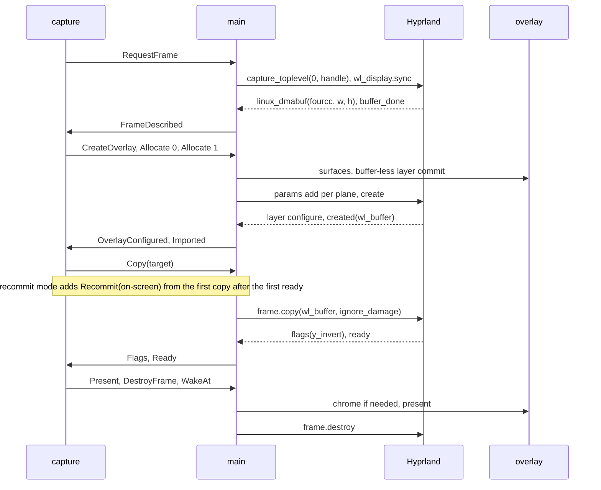

# Rendering

## Scope

Rendering turns each tracked client's window into a live thumbnail. Hyprland copies the window into GPU buffers through its toplevel export protocol, the compositor scales those buffers onto the thumbnail's layer surface, and a subsurface above it carries the ring and the label, drawn on the CPU. The modules are `capture` (the per-client frame and buffer state machine), `dmabuf` (the GBM device, the modifier choice and the import), `chrome` (ring and label pixels), `overlay` (one thumbnail's surfaces) and `protocol` (the generated Hyprland bindings); `main` executes their actions. For the whole-app view see [architecture.md](architecture.md).

## From a window to pixels

Every client has its own thumbnail. There is no shared canvas, and no client waits on another.

| Per client | Purpose |
|---|---|
| Layer surface with a `wp_viewport` and a `wp_alpha_modifier_surface_v1` | shows one dmabuf buffer, scaled to the thumbnail size, at the image opacity |
| Two dmabuf buffers, each a GBM buffer object and its `wl_buffer` | copy targets; at most one is on screen |
| Chrome subsurface at (0, 0) with a `wp_viewport` and an shm pool | ring and label |
| `Capture` machine and one capture timer | frame and buffer state, pacing, failure count |

1. **Request.** `main` sends `capture_toplevel` with `overlay_cursor` 0 and the capture handle (the low 32 bits of the window address), then `wl_display.sync`. Both carry the client's address. Hyprland creates no frame object for a window it does not know, so a sync `done` before any frame event means the window is gone.
2. **Describe.** `linux_dmabuf` gives the fourcc and the size; `buffer_done` hands them to `capture`. The shm `buffer` event and the `damage` events are not used.
3. **Surfaces and buffers.** At the first description `capture` asks for the overlay and for both buffers at the frame's fourcc and size. The thumbnail size is the client's width with the height from the buffer's aspect, rounded to even (`geometry`); the position comes from `layout`, the alpha factor from the effective opacity. `overlay` creates the surfaces and sends a buffer-less layer commit. Each buffer is a GBM buffer object with the `RENDERING` flag, on the render node the default dmabuf feedback names, allocated by `dmabuf` with the feedback's modifiers for that fourcc (tranche order, then index order; duplicates and `DRM_FORMAT_MOD_INVALID` removed). A `format` line prints, then one `zwp_linux_buffer_params_v1` takes from `dmabuf` an `add` per plane (each plane fd closes right after it) and `create(width, height, fourcc, 0)`. The `created` event delivers the buffer's `wl_buffer`.
4. **Later frames.** A description whose size or fourcc does not match the target buffer destroys and reallocates that buffer only, and the copy waits for its `created`. The other buffer follows when it is next the target.
5. **Copy.** It starts when the layer surface has had its first configure, the target buffer is imported at the frame's size and fourcc, and the target is free. `main` sends `copy(wl_buffer, ignore_damage)`. In recommit mode, with a buffer on screen, `main` then re-attaches that buffer on the layer surface with full damage and commits. The capture timer becomes the 1 s stall deadline.
6. **Ready.** `flags` sets `y_invert`, which each request clears, so a frame without `flags` is upright. `ready` makes the target the on-screen buffer and the previous one displaced, resets the failure count and prints `ready`.
7. **Present.** When the thumbnail has no chrome yet or its size changed, the chrome is drawn and committed on the subsurface first; the subsurface is synchronized, so its content waits for the layer commit. Then on the layer surface, in this order: buffer transform `flipped_180` for `y_invert`, else `normal`; `attach(wl_buffer, 0, 0)`; viewport source the whole buffer, destination the thumbnail size; layer size and margins when the size changed; `damage_buffer` over the whole buffer; `commit`. That one commit applies the image, the chrome, a pending alpha factor and the geometry together. The export frame is destroyed after it, and the next wake is armed.
8. **Release.** Hyprland sends `wl_buffer.release` for the displaced buffer when it no longer reads it, which frees the buffer.

### Opacity

- The effective opacity p is 100 while the pointer is on the thumbnail, otherwise the base opacity (`main`'s `base_opacity`). A thumbnail takes the base again when the pointer leaves.
- Image: the layer surface's multiplier is ⌊`u32::MAX` × p / 100⌋ in 64-bit arithmetic. It is double-buffered and acts on the layer surface only, not on the chrome subsurface.
- Chrome: `chrome` scales the alpha of the ring and label colours to ⌊(a × p + 50) / 100⌋, so a half rounds up, before it premultiplies. At 100 the colours are unchanged; at 0 every canvas byte is 0.
- A hover change that alters p sends `set_multiplier`. A thumbnail that already has chrome redraws it and sends one layer commit, so image and chrome change together; without chrome, the first present's commit applies the factor.
- A runtime change of the base opacity (the control command or the tray) does the same for every non-hovered overlay at once. While hidden there are no overlays; show re-creates them at the new base.

### Redraw triggers

| Trigger | Layer surface | Chrome |
|---|---|---|
| `ready` | present | drawn if none yet or the size changed |
| A recommit-mode copy with a buffer on screen | the on-screen buffer re-attached, full damage, commit | none |
| Resize (grip, wheel, account key change) | size, viewport destination and margins, one commit; no attach | drawn at the new size first |
| Move (drag, default-row change) | margins, commit; no attach | none |
| Ring owner change (old and new owner), label change | commit | redrawn |
| Hover change of p | `set_multiplier`; commit when chromed | redrawn when chromed |
| Base opacity change, each non-hovered overlay | `set_multiplier`; commit when chromed | redrawn when chromed |
| Show | re-created at the first `buffer_done`, image at the first `ready` | drawn at the first present |

`layout` and `input` decide resize and move geometry; `clients` supplies the ring owner and the label. Chrome redraws other than a present or a resize happen only once the thumbnail has chrome.

### Frame pacing

No surface asks for frame callbacks. Each client paces itself on its capture timer, which a new `WakeAt` replaces:

- One frame is in flight per client; the next request waits for `ready` or the failure path.
- The next request is due at the later of the last copy + 33.333334 ms and the last failure + 500 ms. `ready` and a failure arm a wake for that instant; an early wake re-arms it.
- A due request whose target buffer is still displaced opens a release wait (`release-wait`) and arms nothing. The release ends it (`released`) and the request goes out at once.
- Damage modes: the first copy, and any retry before the first `ready`, uses `ignore_damage=1`. After that, recommit mode (the default) copies with `ignore_damage=0` and re-commits the on-screen buffer; `--ignore-damage` keeps `ignore_damage=1` and never re-commits. Hyprland performs a pending copy at a commit of the captured window's monitor, and `ignore_damage=1` damages that monitor. The re-commit damages only the thumbnail, so it drives the copy only when that monitor is the configured output; an EVE window on another monitor waits for its own monitor's commit.

### Failure path

| Event | Outcome | Thumbnail meanwhile | Lines |
|---|---|---|---|
| `failed` in any state after the request | frame destroyed, a copying buffer freed, count + 1, retry at the pacing instant | the last presented image; nothing before the first `ready` | `failed reason=failed` |
| No `ready` or `failed` 1 s after `copy` (stall) | as `failed` | as above | `failed reason=stall` |
| Fifth consecutive failure | `Remove`: `clients` drops the client, `main` runs the teardown plan | destroyed | `failed`, `client-removed` |
| Sync `done` before any frame event | `Remove`; the frame is dropped without a destroy | destroyed, if it existed | `client-removed` |
| `linux_dmabuf` with a zero dimension | `Remove` | destroyed, if it existed | `client-removed` |
| `buffer_done` without `linux_dmabuf` | exit 1 | | `exit` |
| A `dmabuf` error: unknown fourcc, no modifier, GBM allocation, plane fd, or `failed` of a current import | exit 1 | | `exit` |
| Chrome input region, pool, buffer or attach error; no configured output; layer `closed` | exit 1 | | `exit` |
| The capture timer cannot join the event loop (`event loop: <error>`); the dmabuf params object cannot be created | exit 1 | | `exit` |
| An action whose frame, overlay or buffer is missing | exit 1 | | `exit` |

A `ready` resets the count. A `failed` that arrives while the machine is idle is ignored. The reasons and fields are in the operator reference, [hypr-eve-preview.md](hypr-eve-preview.md).

## Components

### `capture`

**State.** One `Capture` per client: the damage mode, the address and handle, the frame state, two buffer states, the overlay state (absent, or created with a configured flag and per buffer its size, fourcc and imported flag), the attempt number, the consecutive failure count, the last copy and last failure instants, an open release wait, and `y_invert`.

**How.** A pure machine. `handle` takes an input and the current instant from `main` and returns an ordered action list; it does no I/O and reads no clock. The target is the buffer after the on-screen one, buffer 0 when none is on screen.

| Frame state | Next | On |
|---|---|---|
| Idle | Requested | `Start` or `Wake` with the pacing instant past and the target not displaced, or the `Released` that ends a release wait: `RequestFrame` |
| Requested | Described | `FrameDescribed` with a non-zero size; the first one also creates the overlay and both buffers |
| Described | Copying, with the target's buffer index, the copy's start instant and the frame size | configured, target imported at the frame's size and fourcc, target free: `Copy`, then `Recommit` in recommit mode, then the stall wake |
| Copying | Idle | `Ready`: `Present`, `DestroyFrame`, next wake |
| Requested, Described, Copying | Idle | `Failed`, and in Copying a `Wake` past the stall deadline: the failure path |

| Buffer state | Leaves on |
|---|---|
| Free | `Copy`: Copying |
| Copying | `Ready`: OnScreen; failure: Free |
| OnScreen | the other buffer's `Ready`: Displaced |
| Displaced | `Released`: Free |

A `Released` for a buffer in any state but Displaced is ignored. A reallocation only ever hits the target, which is free whenever a frame is described. A new `Capture` starts with its overlay state absent, so its first `buffer_done` creates the overlay.

`teardown` turns what a client holds into the ordered plan: cancel the timer; destroy the frame if it has had an event, else make it an orphan; destroy the overlay; destroy each buffer (`dmabuf` destroys its `wl_buffer`, then its buffer object); mark the client's pending imports superseded. Client removal and hide run it.

**Boundary.** In, from `main`: `Start` (client added, show), `Wake` (capture timer), `FrameDescribed`, `Flags`, `Ready` and `Failed` (export frame events), `FrameMissing` (a sync `done` before any event), `OverlayConfigured` (first layer configure), `Imported` (`created`), `Released` (`wl_buffer.release`). Out, executed by `main` in order: `RequestFrame`, `CreateOverlay` (to `overlay`), `Allocate` (to `dmabuf` and the import list), `Copy`, `Recommit` and `Present` (export frame and `overlay`), `DestroyFrame`, `WakeAt` (capture timer), `Report` (report lines), `Remove` (to `clients`), `Exit` (stop). `main` keeps a pending import listed per params object until its `created` or `failed`; one replaced by reallocation or released by teardown resolves as superseded, and its late `wl_buffer` or params are destroyed without a line.

**Failure.** The failure path above: `Remove` for a missing window, a zero-size frame or the fifth consecutive failure; `Exit` for a description without `linux_dmabuf`. The `dmabuf` errors on an `Allocate` exit 1 in `main`.

### `dmabuf`

**State.** The `Allocator`: the GBM device on the render node that the default dmabuf feedback names, opened at startup. Every buffer object is dropped before it; at exit `main` drops the buffers' and the pending imports' buffer objects first. Per buffer, `DmaBuffer` pairs the buffer object with the `wl_buffer` that `created` delivers.

**How.** `modifiers_for` chooses the modifier list for a fourcc from the feedback's format table (`FormatModifier` entries) and tranches. `Allocator::allocate` maps the fourcc to a GBM format and creates the buffer object with that list. `import` sends the `add`s and the `create` on a params object. `DmaBuffer::destroy` destroys the pair. `fourcc_text` writes a fourcc as its four characters, then in hex. The allocation and import rules are in step 3 above; the destroy order is in `capture`'s teardown plan.

**Boundary.** Only `main` calls it; `report` uses `fourcc_text` for the `format` line. In: the feedback's main device, format table and tranches; a buffer's fourcc and size from `Allocate`; a params object from sctk's `DmabufState`. Out: the `Allocator`, the buffer object, the params object with its requests sent, `DmabufError`. Outside it, in `main`: the feedback probe, creating the params object, the `format` line, the pending import list with its `created` and `failed`, and the `release` routing. Which buffer is allocated, and when, is `capture`'s.

**Failure.** `DmabufError`, exit 1. At startup: the render node directory cannot be read, a render node cannot be inspected or opened, no render node has the main device's number, or GBM device creation fails. Later: the `dmabuf` row of the failure path above; `main` builds its `ImportFailed` from a current import's `failed`, with the fourcc and the modifiers it tried.

### `chrome`

**State.** The label `Font`, parsed once at startup from `label.font_file`, else from the file that one `fc-match -f '%{file}' <label.font>` run prints. Rendering keeps nothing between draws.

**How.** `render` fills a canvas whose size is the thumbnail's logical size × the output scale from `j/monitors`, each axis rounded. The viewport maps it back to the logical size, so the chrome is drawn at device pixels.

1. Every byte is set to 0.
2. Ring, when the client owns the ring and `border.width` > 0: every pixel within r = ⌊scale × width + 0.5⌋ of an edge gets the premultiplied ring colour.
3. Label: ab_glyph at pixel height scale × `label.size`, pen at scale × `label.x`, baseline at scale × `label.y` plus the scaled ascent; kerning between glyphs; each glyph's coverage, clamped to 1, blended source-over with the premultiplied label colour. Pixels outside the canvas and glyphs without an outline draw nothing.

Pixels are premultiplied, bytes B, G, R, A (`wl_shm` ARGB8888), each channel ⌊(c × a + 127) / 255⌋. Opacity scales the alpha before premultiplication (see Opacity).

**Boundary.** In, from `main`: the label and ring owner (`clients`), the border and label style (`config`), the scale, the effective opacity, and the canvas of a new `overlay` pool buffer. Out: the canvas bytes.

**Failure.** A draw cannot fail. At startup a `label.font_file` that cannot be read or parsed exits 2; a failed `fc-match`, or a file it prints that cannot be read or parsed, exits 1 (`fc-match <family>: <error>`).

### `overlay`

**State.** One `Overlay` per thumbnail: the layer surface and its viewport, the alpha object, the chrome subsurface, its surface and viewport, the shm `SlotPool`, the current chrome buffer, the size, the position and the configured flag.

**How.**
- **Creation, in this order.** `wl_surface`; layer surface on layer `overlay`, namespace `hypr-eve-preview`, on the configured output, anchored top and left, margins (y, 0, 0, x), exclusive zone 0 (so the compositor keeps it clear of reserved areas and positions are relative to the usable area), no keyboard, size the thumbnail size; chrome subsurface at (0, 0), its input region set empty so the pointer always lands on the layer surface; chrome viewport; shm pool sized for one logical-size canvas; layer viewport; alpha object with the initial multiplier; one buffer-less layer commit. The layer surface's input region is never set, so it is the whole surface.
- **Configure.** sctk acknowledges every configure. The first one marks the overlay configured and feeds `OverlayConfigured`; later ones change nothing. The configured size is ignored: the daemon sets the size itself.
- **Chrome draw.** Each draw takes a new pool buffer, renders into it, sets the chrome viewport destination to the logical size, attaches it at (0, 0), damages the whole buffer and commits the chrome surface. The previous chrome buffer is dropped: sctk destroys it at once if the compositor no longer holds it, else at its release, and its pool buffer becomes free only then. The pool grows when no free pool buffer fits.
- **Layer requests.** `present` (the order in step 7 above), `recommit` (attach the on-screen buffer, full damage, commit; nothing else), `move_to` (margins, commit), `resize` (size, viewport destination, margins, one commit), `set_alpha` (multiplier only; the next layer commit applies it), `commit` (applies a chrome-only redraw).
- **Destroy, in this order.** Alpha object; chrome viewport, subsurface and surface; chrome buffer (at once, or at its release while the compositor holds it) and pool; layer viewport; layer role, then its `wl_surface` (sctk's order).

**Boundary.** Only `main` calls it. In: the dmabuf `wl_buffer`s, buffer and thumbnail sizes, positions, `y_invert`, alpha factors, and a draw callback that runs `chrome`. Out: surface requests to the compositor, and the layer `wl_surface` that `main` uses to route pointer events and configures to the client.

**Failure.** `OverlayError` (input region, pool, chrome buffer, chrome attach) exits 1. A layer `closed` event exits 1 with `overlay closed by compositor`. A missing configured output at creation exits 1.

### `protocol`

wayland-scanner generates client bindings at build time from the in-tree hyprland-toplevel-export-v1 protocol XML (manager and frame interfaces, version 2). Its version 2 request names `zwlr_foreign_toplevel_handle_v1`, so the generated module imports wayland-protocols-wlr's foreign-toplevel interfaces. `main`, the module's only user, binds `hyprland_toplevel_export_manager_v1` at versions 1 to 2 and sends `capture_toplevel` and, at shutdown, the manager's `destroy`, both version 1 requests. Every other protocol comes from the wayland-protocols (`staging` feature for alpha-modifier), wayland-protocols-wlr and smithay-client-toolkit crates; versions are in the overview's interface table. The generated interface tables are statics with raw C-interface pointers and an `unsafe impl Sync`, so this module allows `unsafe_code` and silences lints, while the crate root denies `unsafe_code` everywhere else.

## Invariants

- A layer surface gets a buffer only after its first configure: present follows a copy, and a copy waits for `OverlayConfigured`. Hyprland raises a protocol error for a buffer on an unconfigured layer surface.
- Every attach on a layer surface is followed by its commit before the next attach; moves and resizes never attach.
- One alpha object per overlay, created before the first commit: a second `get_surface` on the same surface is a protocol error.
- The alpha factor and the chrome alpha change on the same layer commit: the multiplier is double-buffered and the chrome subsurface is synchronized.
- A chrome buffer the compositor holds is never written: every draw takes a fresh pool buffer, and a held pool buffer returns to the pool only after its release.
- A buffer is reallocated only while it is free, so a reallocation never destroys a buffer that the compositor shows or reads.
- At opacity 0 the chrome canvas is all zero; at opacity 100 the chrome colours are unscaled, because ⌊(a × 100 + 50) / 100⌋ = a.
- A frame without `flags` presents upright: `y_invert` is cleared at each request.
- The overlay and both buffer allocations come only from the absent overlay state of a `Capture`, which no input restores, so an overlay is created once per capture lifetime.
