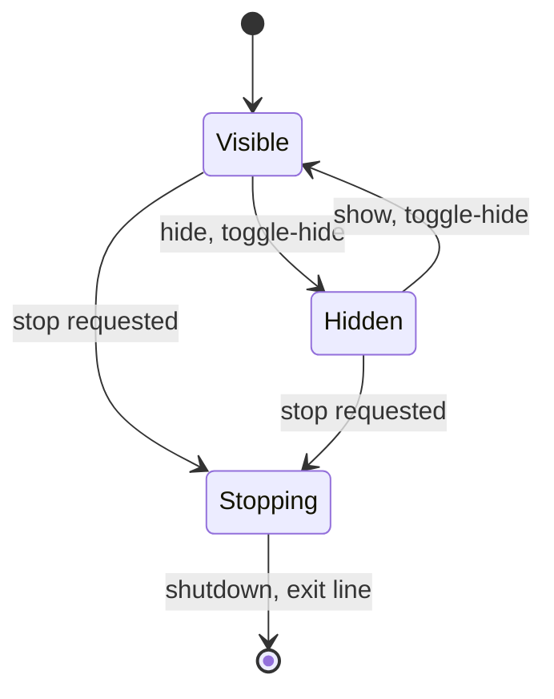

# Runtime: app state, event loop, Hyprland feed, report lines

## Scope

The runtime subsystem is the daemon's spine. `main` holds the app state and runs the one calloop event loop that every input reaches, `ipc` carries the Hyprland traffic that feeds the client model, `hypr` (reply and address parsing, the game-client match, the slot) and `clients` (the client model, its pending and retry rules, the account key) interpret that traffic, and `report` turns state changes, failures and every exit into report lines. For the whole-app view (startup, loop sources, external interfaces, cross-cutting invariants) see [architecture.md](architecture.md).

## The app state

`App` is the loop's data: every source callback gets `&mut App`.

| Group | Fields | Across hide |
|---|---|---|
| Client model | `clients` (`clients::Clients`): per tracked address the pid, title, workspace name, user id and character name; pending addresses with a used-retry flag; the addresses that have a thumbnail; the active address; the ring owner | kept |
| Per-client record | `records`, keyed by address: capture machine, overlay (the thumbnail's layer surface), two buffers, the export frame in flight, capture timer token, position, width, origin (`Default`, `Saved`, `User`), buffer size, chromed flag | position, width, origin kept; the rest dropped |
| Unresolved Wayland objects | `imports` (dmabuf params per owner and buffer index, current or superseded), `orphans` (frames torn down before their first event), `last_sync_id` | kept; the hidden records' imports resolve as superseded |
| Visibility | `hidden`; the lock (`layout.locked`) is copied into `gestures` | |
| Pointer | per-seat pointers, `gestures`, `press`, `hovered` | press, hover cleared |
| Layout-file state | `layout` (`locked`, `snapping`, `opacity`, the entries), its path, the save schedule, `save_timer` | kept |
| Fixed at startup | `config`, `font`, `scale`, `usable`, damage `mode`, `reporter`, the Wayland globals, dmabuf feedback, GBM allocator, the request socket path | kept |
| Hyprland feed | `events` (`ipc::EventSocket`), `event_token`, `retries` (one timer token per pending address) | kept |
| Control | `control` (`Option<control::Server>`, `None` only once shutdown took it), `control_loop` (listener, accept-pause and per-connection source and deadline tokens) | kept |
| Tray | `tray`, `tray_token`, the drain `ping`, `ping_token` | kept |
| Stop | `stop`: `Exit { code, reason }` or `StderrFailed` | |

The Wayland source and the signal source are never removed, so `App` keeps no token for them.

Lock, snapping and opacity are orthogonal to these states.

**Commands.** `apply_command` takes a `control::Command` and its `report::Source`. `before` is `App`'s `Toggles` (`locked`, `hidden`, `snapping`, and `opacity` as the base opacity); `control::apply` gives `after`. Equal toggles run nothing: no line, no save request, no `set_state`, and the socket still replies `ok`. So `opacity <n>` at the current base opacity writes no `opacity` into the layout file. Otherwise each changed field runs its arm: the state, then (opacity only) the overlays, then the line, then a save request (the 500 ms save schedule). After the arms a tray's `set_state(after)` runs once per command, and its pass goes back to the caller.

| Arm | State | Overlays | Line (default level) | Save |
|---|---|---|---|---|
| Lock | `layout.locked`, the `gestures` copy | none | `lock state=on\|off source=socket\|tray` | yes |
| Snap | `layout.snapping` | none | `snap state=on\|off source=socket\|tray` | yes |
| Visibility | hide or show (below), which set `hidden` | inside hide or show | `visibility state=hidden\|shown source=socket\|tray` | no |
| Opacity | `layout.opacity` | alpha and chrome of each non-hovered overlay | `opacity percent=<n> source=socket\|tray` | yes |

- **Hide.** An active gesture ends first with a synthetic `Leave` routed with no pointer, so its last move, the user-placed flag and the layout save run while overlays exist; press and hover clear. Then each record, in address order, runs the `capture::teardown` plan (timer, frame or orphan, overlay, buffers, imports) and drops its capture machine, buffer size and chromed flag. Then `hidden` is set.
- **Show.** `hidden` clears; each record gets a new capture machine and `Start`. Each overlay returns when `capture` asks for it at the first described frame, placed by `position_for`: the default-row position for a `Default` client, else the kept position, clamped.
- **While hidden.** A new client gets a record without a capture machine. `feed` ignores such records, so title, workspace, focus and removal take their normal paths with nothing to draw.
- **Lock, snap.** Neither touches an overlay or a capture; both work while hidden.
- **Stop.** `App::stop` keeps the first `Stop`; `App::emit` overwrites it with `StderrFailed` when a report write fails. Code 0 stops: SIGINT or SIGTERM (`signal SIGINT`, `signal SIGTERM`), the tray `Quit` (`tray quit`), `--seconds` (`seconds elapsed`). Every fatal error stops with code 1. With a stop pending, `feed`, `execute`, `apply_changes`, `run_effects` and the pointer, event-socket and accept callbacks return early, and `control::apply` returns the old toggles.
- **Signals.** calloop's `Signals` source blocks SIGINT and SIGTERM on the thread and reads them from a signalfd as loop events.

## The event loop

`main` calls `EventLoop::dispatch` itself instead of `run`, so it can take the stop and apply `--seconds` between dispatches. One iteration:

1. A pending stop is taken and the loop ends.
2. `dispatch(timeout)`; the timeout is the time left to the `--seconds` deadline, which counts from process start, or none.
   1. The Wayland source flushes queued requests and prepares a read; events already in its queue make the poll return at once.
   2. One poll. When the Wayland queue already held events, the Wayland callback runs first; the ready sources' callbacks then run in poll order, with no other priority.
   3. The idle callbacks run.
3. A dispatch error stops with code 1: the connection's Wayland error text when it has one, else `event loop: <error>`.
4. A passed deadline stops with code 0.

The Wayland callback dispatches the queue into the sctk handlers and `Dispatch` impls on `App`, then flushes. A request another callback makes (a capture request after a window event, a layer commit after a command) goes out at the next Wayland flush: the Wayland callback's own when it runs later in the same dispatch, else the flush before the next poll.

| Source | Token in `App` | Leaves the loop | With a stop pending |
|---|---|---|---|
| Wayland, signals | none | never; both live until the process exits | dispatched as usual |
| Event socket | `event_token` | EOF or read error: the callback returns `Disable`; shutdown removes it last | returns without reading |
| Control listener | `control_loop.listener` | an accept error returns `Disable` until the pause timer re-enables it | returns without accepting |
| Accept pause timer | `control_loop.pause` | one shot | re-enables the listener |
| Connection source, deadline | `control_loop.connections` | both forgotten when the connection ends | a completed line closes it without a reply; the deadline does nothing |
| Capture timer | the record's timer | one shot; a new `WakeAt` and the teardown plan remove an armed one | `feed` ignores the `Wake` |
| Lookup retry | `retries` | one shot; cancelled once its address is no longer pending | the query runs and `clients` takes the result (`add` or `lookup_missed`); `apply_changes` then drops the changes |
| Layout save | `save_timer` | one shot | writes the layout |
| Tray fd | `tray_token` | returns `Remove` once the tray has ended; `end_tray` removes it from outside its own callback | the drain loop runs; no command applies |
| Drain ping | `ping_token` | removed by `end_tray` | the drain loop runs; no command applies |

Shutdown removes every token it still holds.

**Drain loop.** The tray serves the bus on the loop thread in passes (`tray::Pass`). A pass ends at the first menu command, so a click is applied before the next bus message is read. A pass that flushed may have pulled more messages into the connection's own queue, and the level-mode fd does not report those. `drain_loop` therefore chains passes: after a state-changing command, the pass `set_state` returned; otherwise a fresh `drain` while the pass set `more`. It stops at a pass with neither, at `Quit` (stop, code 0), at a bus error (`end_tray`), or at the bound of 16 passes (`MAX_DRAIN_PASSES`), which counts the `set_state` passes. Pass 16 applies no command: `Tray::defer` puts it back at the front of the pending list. If pass 16 had a command or `more`, `tray-unavailable reason="drain: 16 passes"` prints and the drain ping fires, so the drain goes on in a later dispatch after the other ready sources have run; the tray stays up. Entry points: the tray fd callback (`in_tray_callback`, so `end_tray` leaves the source's removal to its `Remove` return), the drain ping, once at startup after the sources are inserted, and a control command that changed state (its `set_state` pass, the first pass, runs before the `ok` reply; the drain loop applies its events after the reply).

**Idle callbacks.** One use: `end_tray` moves the `Tray` into an idle callback that drops it. Its sources leave the loop first, through `LoopHandle::remove` or, inside the tray fd's own callback, through `Remove`, which calloop unregisters only after that callback returns. Idle callbacks run after every source callback of the dispatch, so the bus connection closes only after its sources have left the loop.

**End.** The loop ends at the first iteration that finds a stop, and `App::shutdown` runs (see `main` below). No callback exits the process. The `EventLoop` and its `Signals` source live until `process::exit`, so SIGINT and SIGTERM stay blocked through teardown and a late signal stays pending.

## The Hyprland feed

**Sockets.** `ipc::sockets` derives every path from `XDG_RUNTIME_DIR` and `HYPRLAND_INSTANCE_SIGNATURE`, both set and non-empty, else exit 1 with `<VAR> is unset or empty`. The instance directory `$XDG_RUNTIME_DIR/hypr/$HYPRLAND_INSTANCE_SIGNATURE/` holds `.socket.sock` (requests), `.socket2.sock` (events) and the daemon's control socket `.hypr-eve-preview.sock`. The command form resolves the same paths.

**Request socket.** `ipc::request` opens one connection per request, sets 1 s read and write timeouts (`REQUEST_TIMEOUT`), writes the request text with no terminator, reads the reply to EOF and requires UTF-8. It blocks the loop thread: each read call and each write call waits at most 1 s, so a reply that arrives slowly can block longer. `hypr` parses the JSON replies.

| Request | Sent | Failure |
|---|---|---|
| `j/monitors` | once at startup; the entry named `output` gives scale and usable area | exit 1; no such entry: `no monitor named <output> in j/monitors` |
| `j/clients` | at startup (the snapshot); per `Lookup` and per retry | exit 1 at startup; stop, code 1, at runtime |
| `j/activewindow` | once at startup; `{}` is no active window | exit 1 |
| `/dispatch workspace name:<ws>` | per `Click` effect, with the client's current workspace name | never fatal: `dispatch` prints `reply="ok"` for the exact reply `ok`, else `error=` with the request error or the reply text |

A `j/*` failure reason is `request <text>: <error>`. There is no focus request; the workspace dispatch is the only dispatcher.

**Event socket.** `EventSocket::connect` connects once, non-blocking, for the daemon's life. Each wake calls `read_lines`: read until `WouldBlock` (an interrupted read retries), split complete lines at `\n`, replace invalid UTF-8 (such as a character cut at the end of the data) with U+FFFD, keep a partial tail for the next read. A line is `<name>>><data>`; `ipc::parse_event` splits at the first `>>`, handles five names and skips every other name without a line.

| Event | Data, split at | `clients` change | `main` follow-up |
|---|---|---|---|
| `openwindow` | address, workspace, class, title (first three commas) | game class and title, address neither tracked nor pending: pending, `Lookup` | `j/clients` lookup |
| `closewindow` | address | tracked or pending: removed, reason `closed` | teardown, `client-removed`, default row |
| `windowtitlev2` | address, title (first comma) | tracked, game title: title and character name updated, `Title`; tracked, other title: removed, reason `title "<title>"` | `title`; key-change rule; chrome redraw when the label changed |
| `movewindowv2` | address, workspace id (unused), workspace name (first two commas) | tracked: workspace updated, `Workspace` | `workspace`; chrome redraw when the label changed; default row |
| `activewindowv2` | address, or empty for none | active address set, for any address; ring owner recomputed | on an owner change: both chromes redrawn, `focus` |

The bounded splits keep commas inside the last field. `clients` changes nothing for an untracked address beyond the rows above. No monitor event is consumed: scale and usable area stay as `j/monitors` gave them at startup, and the `wl_output` handlers do nothing.

**Matching.** A window is a game client when its class is `steam_app_8500` and its title is `EVE` or starts with `EVE - ` (`hypr::is_game_client`). Event lines carry the address as bare hex and `j/clients` as `0x` hex; both parse to the same `u64` (`hypr::parse_event_address`, `hypr::parse_address`), which keys `clients`, `records` and `retries`. `openwindow` only triggers the lookup: `Clients::add` tracks the client from its `j/clients` entry (pid, title, workspace), and only when that entry is itself a game client; otherwise the pending address is dropped without a line. Before `Clients::add`, `main` gets the user id through `clients::read_user_id`, which reads and decodes the process command line; a failure prints `account` and the key falls back to the character name.

**Retry.** A window can be announced before `j/clients` lists it. At the first miss `Clients::lookup_missed` returns `Retry`, and `main` arms a 100 ms one-shot timer whose lookup either tracks the client or, at the second miss, removes the pending address with reason `not listed by j/clients`. While pending in `clients`, `closewindow` removes it (`closed`) and `activewindowv2` sets the active address; other events for it are ignored. Every change batch ends by cancelling the retry of each address that is no longer pending.

**Startup agreement.** The event socket connects before the `j/clients` snapshot, so events from that point queue in the socket until its source is inserted, after the snapshot clients are added. A window in both the snapshot and a queued `openwindow` is already tracked, so `clients` changes nothing for the event; a `closewindow` for an address never tracked changes nothing either. `j/activewindow` seeds `Clients::new`, and later `activewindowv2` lines replace it.

| Feed failure | Effect |
|---|---|
| Environment variable unset or empty | exit 1 before any socket opens |
| Event socket connect error | exit 1 at startup: `event socket: connect <path>: <error>` |
| EOF or read error at runtime | stop, code 1, `event socket: EOF` or the error; the source is disabled; lines read in the same call are dropped; no reconnect |
| Lookup retry timer cannot join the loop | stop, code 1, `event loop: <error>` |
| Handled name, bad data | `ignored line=<json>`; the feed continues |
| Unknown name | skipped, no line |

## The report lines

- **Line.** `report::Line` has one variant per class. Its `Display` is the exact text after the prefix; strings and paths print as JSON strings, except the `start` line's `output`; absent values as `-`. `Line::level` marks `format`, `ready`, `release-wait` and `released` verbose and every other class default. `main` builds most lines, `capture` returns its own inside `Action::Report`, and only `main` emits.
- **Sinks.** `Reporter` holds an optional log file and the verbose flag. `emit` drops a verbose line unless `--verbose` is set, then writes `hypr-eve-preview: <line>\n` to stderr with one `write_all` and a flush, then the same line to the log file. A failed stderr write skips the log. `Reporter::open` creates the log's missing parents and opens it for append. Without `--log` the reporter writes stderr only; usage errors and the command form use a non-verbose stderr reporter.
- **`start`.** Printed once, after the reads of config, font, layout, sockets and the three Hyprland queries, before the event loop and Wayland exist. Only a startup `layout-error` prints before it. If its write fails, the control socket file is removed and the process exits 1 without a line.
- **`exit`.** Every daemon exit goes through `finish`, which builds the line with `report::exit_line`, prints it and calls `process::exit` with its code. Before `App` exists, `fail` calls `finish` directly; afterwards `App::shutdown` does. A teardown error (control socket removal, Wayland flush) is appended as `; teardown: <error>` and raises code 0 to 1.
- **Write failure.** A failed write to either sink stops the daemon with exit 1 and no `exit` line, also after a log-only failure while stderr still works. Before `App` exists `emit_or_finish` exits 1; inside `App` the stop becomes `StderrFailed`, which overrides the earlier reason and also wins when a line written during shutdown fails. `finish` then exits 1 without an `exit` line. A failed `exit` line write also exits 1.
- **Guarantee.** The daemon's last line is `exit` unless a report write failed. The command form prints nothing on success, only `exit` on a failure, and `usage` then `exit` on a usage error.
- **Codes.** The stop site picks the code: 0 for a signal, the tray `Quit` and `--seconds`; 2 only for usage, config and `label.font_file` errors, all before the loop; 1 for everything else, plus the teardown and write-failure rules above. The line catalogue and the cause table are in [hypr-eve-preview.md](hypr-eve-preview.md).

## Components

### `main`

- **State.** `App` and `Stop` (section above), and the startup bundles `Startup` and `Parts` that hand the reads and the Wayland binds to `setup`. `Frame` is a frame in flight: the export-frame proxy, its sync id, whether it had an event, and the `linux_dmabuf` description held until `buffer_done`. Only `main` holds the loop handle.
- **Derived values.** `base_opacity` (a free function and an `App` method) is the layout file's `opacity` when set, else `thumbnail.opacity`; `effective_opacity`, the hover change (the value a leave restores), overlay creation and `toggles` read it. `snap_distance` (likewise) is `thumbnail.snap_distance` while `snapping` is on, else 0; `drag` passes it to `layout`. `toggles` builds `apply_command`'s `before` and the tray's initial `Toggles`, so the tray starts with the saved lock, snapping and opacity.
- **How.** An executor around pure machines: `capture` actions, `input` effects and `clients` changes come back as lists that `main` runs in order, re-checking the stop before each step. Wayland events reach their client through the frame's user data (the address), the surface (`thumbnail_at`), the params object (`imports`) or a buffer lookup. Hide ends the pointer interaction (`App` state), then touches only per-record handles: it releases what the teardown plan names and keeps the record; show only creates a capture machine per record, and the overlay and buffers follow from its actions.
- **Boundary.** In: `cli` (`Invocation`), `config`, `layout` (file, save schedule), `ipc` (`Event`s, replies), `clients` (`Change`s), `capture` (`Action`s), `input` (`Effect`s), `control` (admissions, read outcomes), `tray` (passes), Wayland events. It uses `hypr` (reply parsing, the game-client check, the capture handle), `chrome` (font resolve and load at startup; the chrome buffer size and the render it hands `overlay`) and `geometry` (`thumbnail_size`). Out: Wayland requests (its own; `overlay` and `dmabuf` on its behalf), Hyprland requests through `ipc`, lines through `report`, layout writes through `layout`. The tray startup and every bus exchange continue in `tray`; the socket protocol continues in `control`.
- **Failure.** Once the control socket is bound, every early exit removes its file: a failed Hyprland query, the `start` write, the event loop build and the Wayland binds pass `remove_control` to `fail` or `finish`. Once `App` exists, every failure runs `App::shutdown`, including a failed roundtrip, output lookup or Wayland source insert inside `setup`, the signal source and the event-socket and control source inserts. Shutdown order:
  1. Control: the listener, pause and per-connection sources leave the loop; `Server::remove` then shuts every connection without a reply and unlinks the file.
  2. Tray: its fd source and the ping leave the loop; the `Tray` drops directly.
  3. Timers: every capture timer, the save timer and every lookup retry; then a pending layout save is written.
  4. Wayland objects: per record, a frame that had an event is destroyed (one without is left alone), then the overlay, then each `wl_buffer`, its buffer object kept; then every pending params object; then the pointers, the export manager and the alpha manager.
  5. The connection is flushed, so every destroy request is sent before the buffer objects, the pending imports and the GBM device drop.
  6. The event-socket source leaves the loop, then `EventSocket` drops.
  7. `finish` prints `exit`; a `StderrFailed` raised during these steps replaces the stop.

### `clients`

- **State.** `Clients`, with the fields of the app-state table's Client model row. `Tracked` is one tracked client; `Change`, `AccountKey` (`user:<id>` or `character:<name>`) and `AccountError` are plain values.
- **How.** `Clients` is a pure machine: `apply` takes an `ipc::Event`, `add` a `j/clients` entry with its user id, `lookup_missed` a missed lookup, `remove` a capture removal, `thumbnail_created` a new thumbnail, and each returns a `Change` list. The feed section's event table, Matching and Retry give the changes. The ring owner is the active address while that address has a thumbnail. `ordered` gives the default row its order: slot ascending, clients without a slot last, then address. `Tracked` derives the slot (`hypr::eve_slot`), the label (the character name, else the workspace name when it gives a slot, else `EVE`) and the account key (`User` from the user id, else `Character` from the latest title with a name, else none). `read_user_id` is the module's only I/O: it reads `/proc/<pid>/cmdline` and decodes the first `/LauncherData=` argument.
- **Boundary.** In, all from `main`: `Event`s from `ipc`, `hypr::Client` entries from the snapshot and each lookup, the user id (`main` calls `read_user_id` only for a game-client entry), `capture`'s `Remove` reasons, and each overlay creation. Out: `Change` lists, which `apply_changes` runs in order; reads for `main`: `get` (label, slot, key and workspace for report lines, chrome, layout keys and the workspace dispatch), `ring_owner` (chrome), `ordered` (default row), `is_pending` (stale-retry cancellation). It arms no timer, sends no request, keeps no record and prints no line; `main` does each of these for the changes. The match and the slot come from `hypr`.
- **Failure.** No `Clients` call fails. `read_user_id` returns `AccountError` (`Unreadable` with the I/O error kind, `Missing`, `Base64`, `Text`), whose texts name no part of the command line. `main` prints it as `account`, and the client is tracked without a user id.

### `ipc`

- **State.** `EventSocket`: the non-blocking stream and a `LineBuffer` holding the bytes after the last newline. `Sockets` is a plain value. A request keeps nothing after it returns.
- **How.** `sockets`, `EventSocket::connect` and `read_lines`, `parse_event`, `request`, `workspace_dispatch` and `dispatch_result`, as the feed section describes. Event-address parsing comes from `hypr`.
- **Boundary.** In: the two environment values from `main`; event bytes and replies from Hyprland. Out: `Event`s, which `main` hands to `clients`; reply text, which `hypr` parses for `main`; the dispatch result for the `dispatch` line. It registers no loop source: `main` watches a duplicate of the event socket's descriptor and calls `read_lines` on the original.
- **Failure.** `IpcError`: `Env`, `Connect`, `Eof`, `Timeout` (a read or write past 1 s), `Io`, `NotUtf8`, `BadEvent` (a handled name whose data does not parse). Its `Display` texts become exit reasons and the `dispatch` error field; `main` picks the consequence by the feed failure table.

### `hypr`

- **State.** None. `Client` (address, class, title, workspace name, pid) and `Monitor` (name, size, scale, transform, reserved edges) are the `j/clients` and `j/monitors` entry shapes; unknown fields are ignored.
- **How.** No I/O: each function maps text or a value to a value. `parse_clients`, `parse_monitors` and `parse_active_window` (`{}` is none) parse reply text. `parse_address`, `parse_event_address`, `is_game_client` and `is_game_title` are the Matching paragraph's rules. `eve_slot` gives the slot of an `EVE<n>` workspace name, n from 1 to 12 with no leading zero. `Monitor::usable_area` is the output's pixel size, swapped for an odd transform, divided by the monitor scale and rounded to logical px, minus the reserved edges. `capture_handle` is the low 32 bits of the address, the window handle that `capture_toplevel` takes. `GAME_TITLE_PREFIX` (`EVE - `) is the one copy of the title prefix; `clients` strips it for the character name.
- **Boundary.** In: reply text, which `main`'s `query` gets through `ipc::request`; the address fields of event lines, from `ipc::parse_event`. Out: to `main`, the startup monitors (scale, usable area), snapshot and active address, each lookup's entries, the game-client check before a user-id read, and the capture handle for `Capture::new` and `capture_toplevel`; to `clients`, the match, the title prefix and the slot; to `ipc`, event addresses. It uses `geometry` for the usable area's `Rect`. It opens no socket and picks no request: `ipc` sends, and `main` chooses the request and the consequence of a failure.
- **Failure.** `HyprError`: `Json` (a reply that is not JSON of the expected shape, a bad `j/clients` address included) or `InvalidAddress`. `query` turns it into the `j/*` failure reason `request <text>: <error>`; `ipc::parse_event` turns an address error into `BadEvent`.

### `report`

- **State.** `Reporter`: the optional log file and the verbose flag. `Line`, `Level`, `DamageMode`, `FailReason` and `Source` are plain values.
- **How.** `emit_to` formats the prefixed line into one buffer and writes it with one `write_all` and a flush; `emit` calls it once per sink. `exit_line` applies the teardown rule to the exit code and reason.
- **Boundary.** In: `Line` values from `main` and, through actions, from `capture`. Out: bytes to stderr and the log file. `exit_line` serves `main`'s `finish`; `DamageMode` is also the mode `capture` runs in. It uses `control` (`COMMANDS`, `Command::word`, `OPACITY_WORD`) to build the `usage` line's syntax in `syntax()`, `dmabuf` for the fourcc text and `geometry` for sizes.
- **Failure.** `emit` returns the first write error and never retries; `main` turns it into `StderrFailed`.

## Invariants

- Every daemon exit passes through `finish`, so the last line is `exit` with the code the process exits with; only a failed report write exits without it, always with code 1.
- While no stop is pending, `records` and the tracked set of `clients` hold the same addresses: records are created and removed only by `Added` and `Removed` changes.
- The event-socket and tray sources leave the loop before the object they watch drops (`EventSocket`, the `Tray`), and at shutdown the control sources leave before `Server::remove`. A control connection's stream closes first and its source leaves in the same callback; only a failed deadline-timer insert removes the source first. Each watched descriptor is a duplicate that closes with its own source.
- While no stop is pending, a retry timer exists only for a pending address, at most one per address: every change batch ends by cancelling stale retries, and the used-retry flag allows one. Shutdown cancels the rest.
- The event socket connects before the startup `j/clients` query, so the snapshot plus the queued events cover every window, and a repeated `openwindow` or an unknown `closewindow` changes nothing.
- Each event-socket wake reads to `WouldBlock`, so while no stop is pending no complete line waits for another wake.
- A Hyprland request uses its own connection, closed when `request` returns, and waits at most 1 s per read or write.
- A report line reaches stderr before the log file, one `write_all` per sink, and a verbose line is filtered before either.
- A drain loop runs at most 16 tray passes, and a command from the last pass is deferred to a later loop, neither applied nor dropped.
